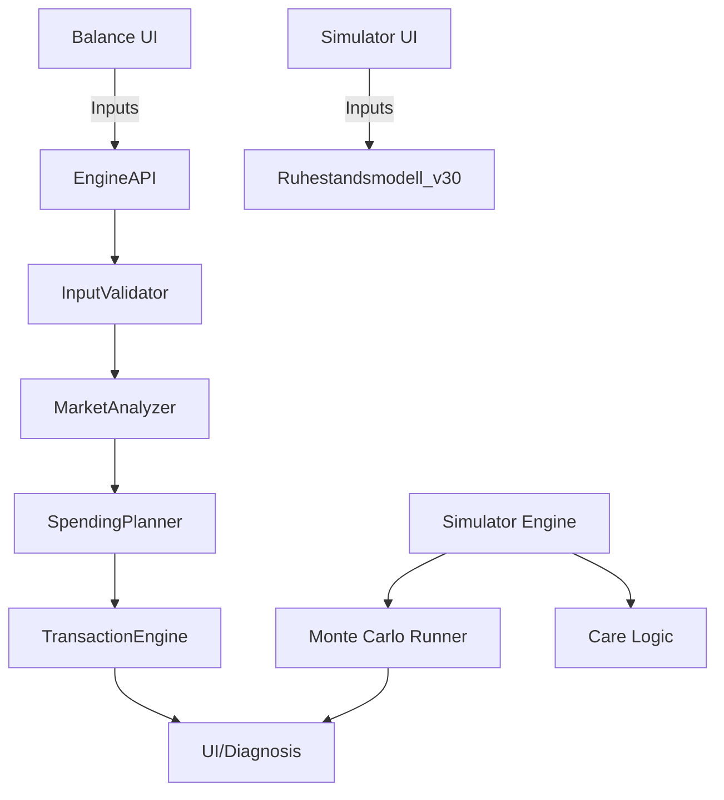

# Ruhestand-App Auditbericht

> **Hinweis:** Dieser Auditbericht wurde vor der Adapter-Eliminierung erstellt (Dezember 2025).
> Die referenzierten Dateien `simulator-engine.js` und `sim-parity-smoketest.js` wurden seitdem
> entfernt. Siehe `ADAPTER-ELIMINATION-REPORT.md` für Details zur Migration.

---

## Executive Summary
- Engine steuert Entnahmen über Guardrails (Entnahmequote, realer Drawdown, Runway) und liefert Diagnosepfade für die UI.【F:engine/planners/SpendingPlanner.mjs†L12-L168】
- Simulator besitzt Fail-Safe-Liquiditätslogik (Floor-Deckung, Notverkäufe) sowie Pflege- und Rentenhandling pro Jahr.【F:simulator-engine.js†L24-L200】
- Datengrundlage umfasst Pflegeprogression aus dem Barmer-Pflegereport und statische historische Marktreihen ohne Aktualisierungsautomatismen.【F:simulator-data.js†L5-L120】
- Tests decken Parität zwischen Engine und Simulator sowie Pflege-Dualfälle ab; Browserabhängigkeit begrenzt Automatisierung.【F:sim-parity-smoketest.js†L3-L66】【F:test-dual-care.js†L3-L119】
- Methodik robust dokumentiert, jedoch fehlende Quellenverlinkungen und begrenzte Testtiefe für Steuern/DE-Spezifika.

## Architektur

## Module-Übersicht
| Modul | Zweck | Zentrale Funktionen | Inputs → Outputs | Evidenz |
|-------|-------|---------------------|------------------|---------|
| SpendingPlanner | Jahresweise Entnahme- und Guardrail-Logik | `determineSpending`, `_applyGuardrails` | Markt, Bedarf, Runway → Entnahmeplan & Diagnose | 【F:engine/planners/SpendingPlanner.mjs†L12-L168】 |
| Simulator Engine | Jahres-Loop mit Liquiditäts-Guard, Pflegekosten, Verkäufen | `simulateOneYear`, `computeLiqNeedForFloor`, `sellAssetForCash` | Portfolio, Inputs, Marktdaten → Jahresergebnis | 【F:simulator-engine.js†L24-L200】 |
| Simulator Data | Statische Pflege- und Marktdaten | Konstanten | Eingebettete Quellen → Datensätze für Simulation | 【F:simulator-data.js†L5-L120】 |

## Guardrails & Trigger
| Regel | Definition | Parameter | Effekt | Evidenz |
|-------|------------|-----------|--------|---------|
| Entnahme-Guardrails | Entnahmequote, realer Drawdown, Runway vs. Schwellen; optionale Inflation-/Budget-Caps | `CONFIG.THRESHOLDS`, Profil-Runway, Ziel-Runway | Kürzungen/Diagnose, verhindert riskante Entnahmen | 【F:engine/planners/SpendingPlanner.mjs†L109-L157】 |
| Fail-Safe Liquidität | Mindest-Cash für Floor, Notverkäufe von Gold/Aktien | `inflatedFloor`, `runwayTargetMonths`, `minGold` | Erzwingt Liquidität, auch bei Zielverfehlung | 【F:simulator-engine.js†L24-L161】 |

## Annahmen
| Thema | Default/Range | Kontext | Evidenz |
|-------|---------------|---------|---------|
| Runway-Ziel | Default 12 Monate, fallback bei ungültigen Werten | Cash-Guard im Simulator | 【F:simulator-engine.js†L50-L55】 |
| Floor-Deckung | 0 € Bedarf akzeptiert, wenn Rente Floor abdeckt | Verhindert künstliche Verkäufe | 【F:simulator-engine.js†L31-L45】 |
| Pflegeprogression | 0–15% p.a. je Grad/Alter | Barmer-basierte Progressionsannahmen | 【F:simulator-data.js†L25-L50】 |

## Datenquellen & Reproduzierbarkeit
| Quelle | Datei | Aktualisierung | Reproduzierbarkeit | Evidenz |
|--------|-------|----------------|--------------------|---------|
| Barmer Pflegereport 2024 | `simulator-data.js` | Manuell, hart kodiert | Keine Rohdaten-Links, nur kommentierte Annahmen | 【F:simulator-data.js†L5-L50】 |
| Historische Marktdaten 1950–2013 | `simulator-data.js` | Statisch im Code | Keine Skripte/Quelle angegeben | 【F:simulator-data.js†L53-L120】 |

## Tests & Invarianten
| Test | Scope | Guarded Behavior | Limitierungen | Evidenz |
|------|-------|------------------|--------------|---------|
| Parity Smoke Test | Browser-basierter Vergleich Engine vs. Simulator (mehrjährige Schleife) | Abbruch bei Ruin/Fehler, Mismatch-Logging | Keine Headless-Ausführung ohne Browser | 【F:sim-parity-smoketest.js†L3-L66】 |
| Dual Care Test Suite | Node-Test für Pflegekosten & RNG-Forks | Unabhängigkeit von Zufallsströmen, additive Pflegekosten | Deckt keine Steuern/Inflation ab | 【F:test-dual-care.js†L3-L119】 |

## Bewertung (0–100)
| Kategorie | Gewicht | Note | Begründung |
|-----------|---------|------|------------|
| Methodik Entnahme/Guardrails | 30 | 26 | Klare Guardrails und Diagnosen, aber begrenzte Dokumentation zu Kappungen/Edge-Cases.【F:engine/planners/SpendingPlanner.mjs†L109-L157】 |
| Risiko-/Renditemodell | 20 | 14 | Monte-Carlo/Regime angedeutet, Fail-Safe Liquidity vorhanden, jedoch keine Tail-Risk/Bootstrap-Dokumentation im Codeauszug.【F:simulator-engine.js†L24-L200】 |
| DE-Realismus (Steuern/KV/Pflege) | 15 | 10 | Pflege-Progression vorhanden, aber Steuer-/KV-Details fehlen in geprüften Modulen.【F:simulator-data.js†L5-L120】 |
| Datenquellen & Reproduzierbarkeit | 15 | 8 | Statische Daten ohne Aktualisierungswege; Quellen nur kommentiert, nicht verlinkt.【F:simulator-data.js†L5-L120】 |
| Testabdeckung & Invarianten | 10 | 6 | Zwei Tests (Parity, Dual Care); Browserabhängigkeit und keine automatisierten Steuer-/Guardrail-Tests.【F:sim-parity-smoketest.js†L3-L66】【F:test-dual-care.js†L3-L119】 |
| Erklärbarkeit/UX/Reporting | 10 | 8 | Diagnosepfade vorhanden, aber Reporting hängt von UI; keine eigenständigen Audit-Logs im Codeauszug.【F:engine/planners/SpendingPlanner.mjs†L39-L168】 |
| **Gesamt** | **100** | **72** | gewichteter Durchschnitt |

## Risiken & Empfehlungen
| Risiko | Schweregrad | Hinweis |
|--------|-------------|---------|
| Fehlende Datenquellen-Nachvollziehbarkeit | P1 | Statische Marktdaten ohne Herkunft/Checks; Aktualisierungspfad fehlt.【F:simulator-data.js†L53-L120】 |
| Browserabhängige Tests | P1 | Parity-Test benötigt DOM/Window, verhindert CI-Automatisierung.【F:sim-parity-smoketest.js†L3-L66】 |
| Limitierte Steuer-/KV-Abdeckung | P1 | In sichtbaren Modulen keine Validierung oder Tests spezifischer deutscher Steuer-/KV-Regeln.【F:simulator-engine.js†L24-L200】 |
| Guardrail-Kalibrierung | P2 | Schwellenwerte nicht dokumentiert/parametriert über UI; Gefahr von Fehlkalibrierung.【F:engine/planners/SpendingPlanner.mjs†L109-L157】 |

## Evidence Index
| Datei | Inhalt |
|-------|--------|
| engine/planners/SpendingPlanner.mjs | Guardrails, Diagnoseaufbau, Entnahmeberechnung |
| simulator-engine.js | Liquiditäts-Guard, Pflegekostenbezug, Jahresloop |
| simulator-data.js | Pflegewahrscheinlichkeiten, historische Marktdaten |
| sim-parity-smoketest.js | Paritätstest Engine vs. Simulator (Browser) |
| test-dual-care.js | Node-basierte Pflege-/RNG-Tests |
