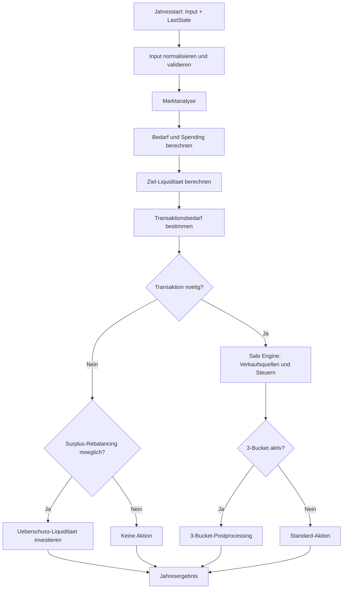
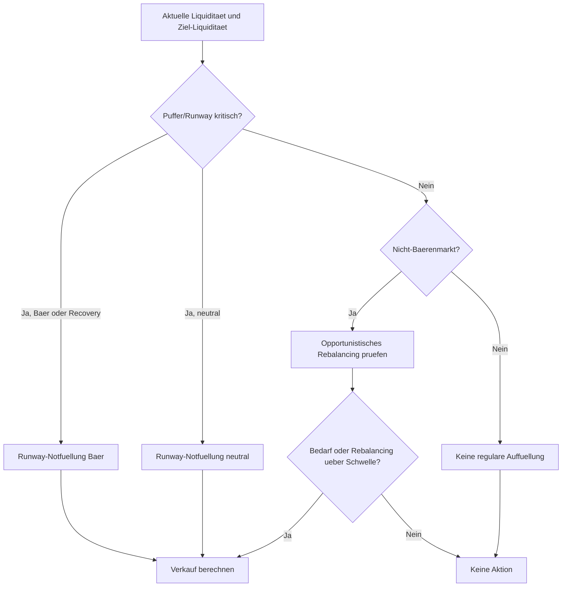
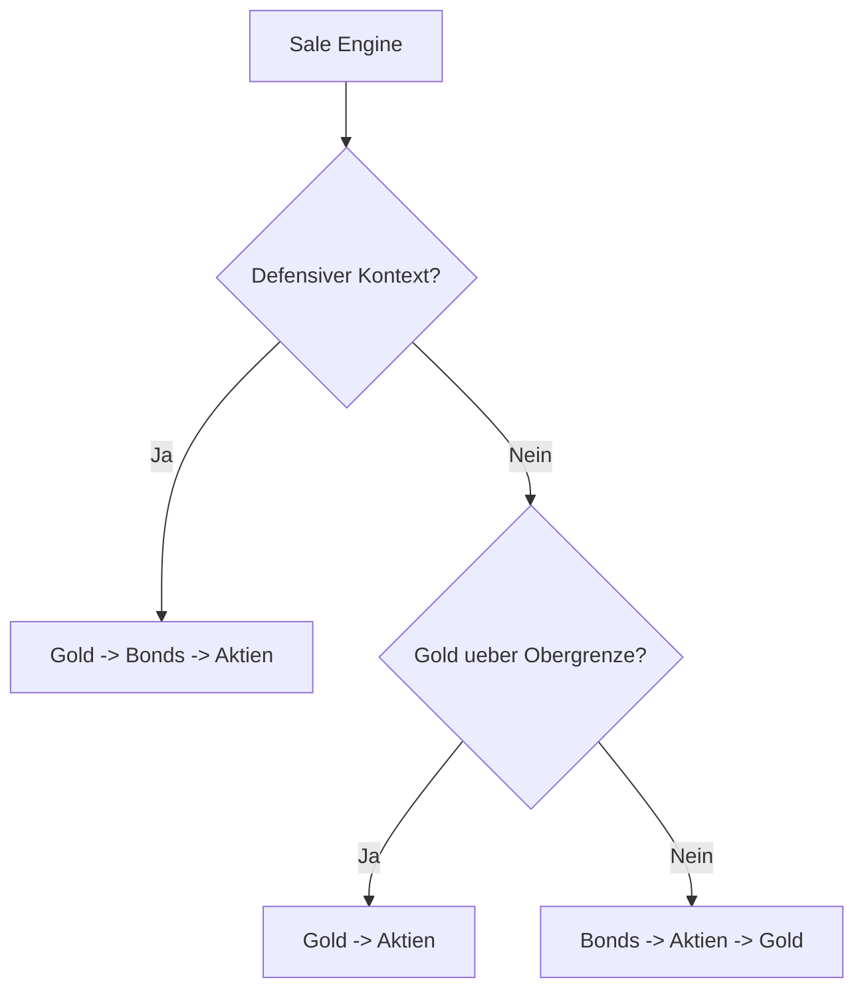
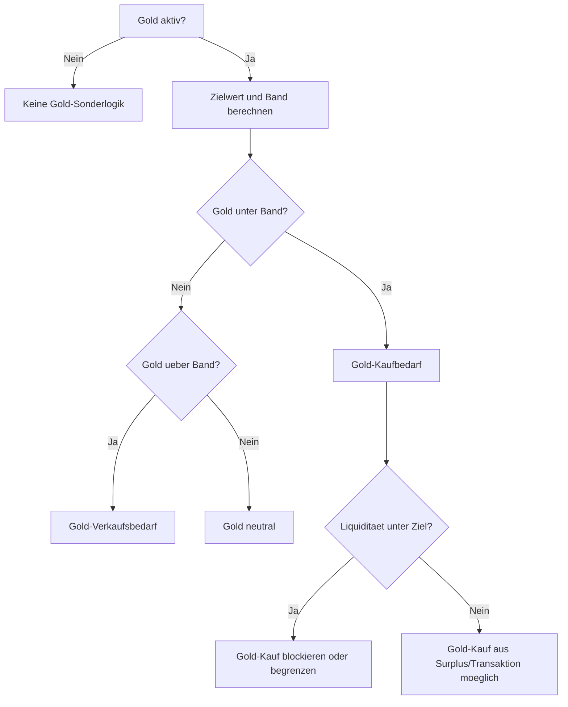
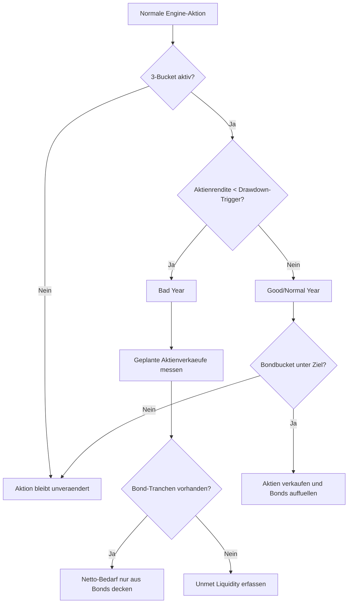
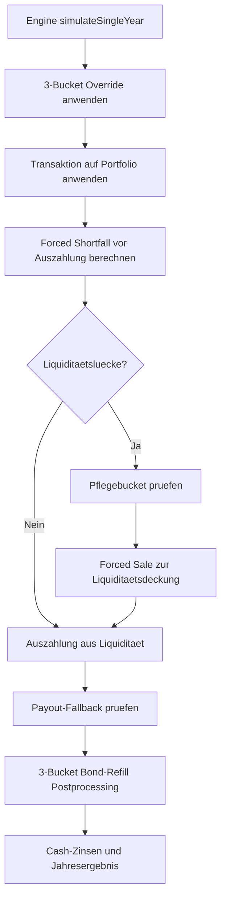
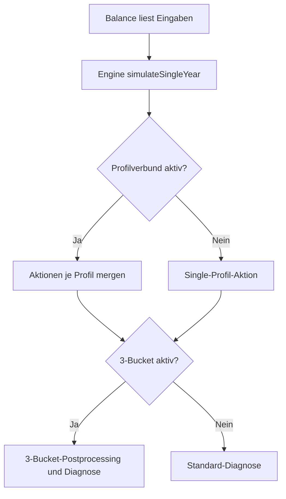

# Engine Decision Logic

Diese Datei beschreibt die fachliche Entscheidungslogik der Engine und der
nachgelagerten Balance-/Simulator-Pfade. Ziel ist eine lesbare Uebersicht fuer
fachliche Diskussionen, nicht eine vollstaendige Code-Dokumentation jeder
Hilfsfunktion.

## 1. Zweck der Jahresentscheidung

Die Engine beantwortet pro Jahr im Kern vier Fragen:

| Frage | Ergebnis |
|---|---|
| Wie hoch ist der geplante Bedarf? | `spendingResult` mit Floor/Flex/Guardrails |
| Wie hoch soll die Liquiditaet sein? | `zielLiquiditaet` auf Basis von Profil, Bedarf und Markt |
| Muss gehandelt werden? | `action.type`: `NONE` oder `TRANSACTION` |
| Wenn gehandelt wird: woher und wohin? | `quellen`, `verwendungen`, Steuerdaten und Diagnose |

Die fachliche Leitidee ist nicht "Liquiditaet immer auf Ziel auffuellen",
sondern "nur handeln, wenn die Regeln einen echten Bedarf oder eine guenstige
Rebalancing-Situation erkennen".

## 2. Jahresablauf



Code-Mapping:

| Schritt | Modul |
|---|---|
| Jahresorchestrierung | `engine/core.mjs` |
| Marktanalyse | `engine/analyzers/MarketAnalyzer.mjs` |
| Spending | `engine/planners/SpendingPlanner.mjs` |
| Ziel-Liquiditaet | `engine/transactions/transaction-utils.mjs` |
| Transaktionsentscheidung | `engine/transactions/transaction-action.mjs` |
| Verkauf/Steuern | `engine/transactions/sale-engine.mjs` |
| 3-Bucket | `engine/transactions/three-bucket-logic.mjs` |

## 3. Liquiditaetsentscheidung

Die Ziel-Liquiditaet wird dynamisch berechnet. Unterhalb des ATH kann das Ziel
Richtung Mindest-Runway sinken; oberhalb des ATH kann der Puffer steigen. In
schwierigeren Marktregimen wird Flex-Bedarf nur teilweise in die Zielrechnung
einbezogen.



Wichtige Zonen:

| Zone | Bedeutung | Typische Aktion |
|---|---|---|
| Komfortzone | Liquiditaet ausreichend | keine Aktion oder Surplus-Rebalancing |
| Toleranzzone | unter Ziel, aber nicht kritisch | haeufig keine Aktion, ggf. Opportunismus |
| Guardrail-Zone | Runway/Coverage unter Schwelle | begrenztes Auffuellen |
| Notfallzone | Zahlungsfaehigkeit/Floor gefaehrdet | Mindestschwellen werden gelockert |

## 4. Verkaufsquellen

Die Verkaufsreihenfolge haengt vom Kontext ab. Sie ist aktuell nicht als
gemeinsame Zielquoten-Logik fuer Gold und Bonds modelliert, sondern durch
Sonderregeln bestimmt.

| Kontext | Aktuelle Logik |
|---|---|
| Defensive Situation oder Emergency Sale | Gold, dann Bonds, dann Aktien |
| Gold ueber Obergrenze | Gold, dann Aktien |
| Standard-Sale-Engine | Bonds, dann Aktien, dann Gold |
| 3-Bucket Bad Year | Aktienverkaeufe werden durch Bond-Verkaeufe ersetzt |
| Simulator Forced Sale ohne 3-Bucket | Aktien, dann Gold |
| Simulator Forced Sale mit 3-Bucket Bad Year | Bonds only |



Hinweis: Im Standardfall sagt der Code-Kommentar "Aktien zuerst", der Code
ordnet aber `bondKeys` vor Aktien ein. Das ist eine fachliche Pruefstelle.

## 5. Gold-Logik

Gold wird ueber Zielquote, Rebalancing-Band und Floor gesteuert.

| Regel | Wirkung |
|---|---|
| Gold unter Untergrenze | Gold-Kaufbedarf kann entstehen |
| Liquiditaet unter Ziel | Gold-Kauf wird blockiert bzw. auf Cash-Surplus begrenzt |
| Gold ueber Obergrenze | Gold-Verkaufsbedarf kann entstehen |
| Gold-Floor aktiv | normale Verkaeufe duerfen den Floor nicht unterschreiten |
| Emergency/Notfall | Gold-Floor kann ignoriert werden |



## 6. 3-Bucket-Jilge

Der 3-Bucket-Modus ist eine nachgelagerte Speziallogik. Die Engine erzeugt
zunaechst eine normale Aktion. Danach kann 3-Bucket diese Aktion veraendern.



Wichtige Parameter:

| Parameter | Bedeutung |
|---|---|
| `decumulation.mode` | aktiviert `3_bucket_jilge` |
| `drawdownTrigger` | Schwelle fuer Bad Year |
| `bondTargetFactor` | Ziel: Faktor mal Jahresentnahme |
| `bondRefillThreshold` | Toleranz, ab wann Refill erfolgt |
| `bondNominalReturn` | feste Bond-Rendite im Simulator |

## 7. Simulator-Zusatzlogik

Der Simulator nutzt die Engine pro Jahr, fuehrt danach aber weitere
Jahresmechaniken aus: Portfolio mutieren, Entnahme auszahlen, Forced Sales und
Bond-Refill.



Forced-Shortfall-Formel im Simulator:

```text
forcedShortfall =
    max(0, JahresentnahmeTarget + 1 Monat Netto-Floor - aktuelle Liquiditaet)
```

## 8. Balance-App-Zusatzlogik

Die Balance-App nutzt dieselbe Engine-Jahresentscheidung. Danach gibt es ein
Postprocessing fuer Profilverbund und 3-Bucket.



## 9. Bekannte fachliche Spannungen

| Punkt | Aktueller Stand |
|---|---|
| Bonds vs. Gold | keine gemeinsame Reserve-Entscheidung nach relativer Ueber-/Untergewichtung |
| 3-Bucket Bad Year | Bonds verdraengen Aktienverkaeufe, Gold wird in dieser Speziallogik nicht gleichrangig betrachtet |
| Standard-Sale-Order | Code verkauft Bonds vor Aktien und Gold; Kommentar nennt Aktien zuerst |
| Simulator Forced Sale | hat eigene Fallback-Reihenfolge, die nicht identisch mit der normalen Sale Engine ist |
| Refill-Logik | Bond-Refill wird in guten Jahren separat aus Aktien finanziert |

Diese Punkte sind keine Fehlerbeschreibung, sondern markieren Stellen, an denen
fachliche Zielsetzung und technische Implementierung bewusst abgeglichen werden
sollten.

