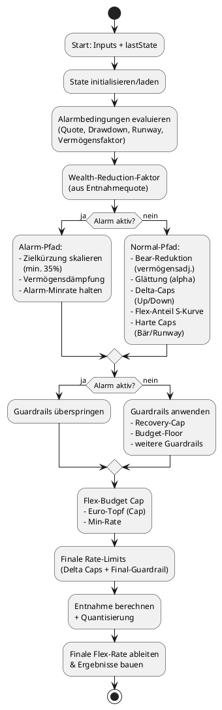

# Technische Dokumentation – Ruhestand-App-Final

Dieses Dokument beschreibt die Architektur und zentrale Datenflüsse der Ruhestand-App. Die Anwendung besteht aus zwei getrennten Oberflächen (Balance & Simulator) und einer gemeinsam genutzten Engine.

**Dokumentrolle:** Operative Entwickler-Referenz für aktuelle Modulzuständigkeiten, Datenflüsse und Laufzeitverhalten.
**Abgrenzung:** Vertiefte fachliche Herleitungen, Marktvergleiche und Forschungsabgleich stehen in `ARCHITEKTUR_UND_FACHKONZEPT.md`.

---

## Architekturüberblick

### Komponenten

| Komponente | Dateien | Zweck |
|------------|---------|-------|
| Balance-App | `Balance.html`, `app/balance/*.js`, `css/balance.css` | Jahresabschluss, Liquiditäts- und Entnahmeplanung, Diagnosen, Ausgaben-Check mit Jahreshistorie |
| Simulator | `Simulator.html`, `app/simulator/*.js`, `simulator.css` | Monte-Carlo-Simulationen, Parameter-Sweeps, Pflegefall-Szenarien |
| Profil/Verbund | `index.html`, `app/profile/*.js`, `app/tranches/*.js` | Profilverwaltung, Profilverbund, Tranchen-Sync |
| Shared | `app/shared/*.js` | Gemeinsame Formatter, Feature-Flags, CAPE-Helfer |
| Engine | `engine/` (ESM) → `engine.js` | Validierung, Marktanalyse, Spending- und Transaktionslogik |

Alle Skripte sind ES6-Module. Die Engine wird per `build-engine.mjs` mit esbuild (oder Modul-Fallback) gebündelt und stellt eine globale `EngineAPI` bereit.

---

## Engine

Die Engine besteht aus acht ES-Modulen, die von `build-engine.mjs` zu `engine.js` zusammengeführt werden. Die Reihenfolge entspricht zugleich der internen Verarbeitungskette:

1. **`engine/validators/InputValidator.mjs`** – prüft sämtliche Eingaben auf Vollständigkeit, Wertebereiche und Konsistenz. Liefert strukturierte Fehlermeldungen.
2. **`engine/analyzers/MarketAnalyzer.mjs`** – klassifiziert Marktregime, berechnet Drawdowns und leitet Kennzahlen für Guardrails ab.
3. **`engine/planners/SpendingPlanner.mjs`** – steuert Guardrails, Glättung der Flex-Rate, Alarmstatus, S-Kurven-Dämpfung nach Flex-Anteil, harte Caps (Bär/Runway), Flex-Budget-Cap (Euro-basiert) sowie die vermögensbasierte Dämpfung der Flex-Kürzung (abhängig von jährlichem Flex-Bedarf und Gesamtvermögen) und erstellt Diagnoseeinträge.

### Flex-Reduktion: Reihenfolge der Caps/Limits

Das folgende Flussdiagramm zeigt die Reihenfolge, in der die Flex-Rate angepasst und begrenzt wird. Entscheidend ist die Abfolge im `SpendingPlanner` (siehe `determineSpending()`):


4. **`engine/transactions/TransactionEngine.mjs`** – leitet Ziel-Liquidität ab, steuert Puffer-Schutz und führt **Gap-basiertes Surplus-Rebalancing** (Investition nur bis Ziel-Allokation) durch.
   - Unterteilt in `engine/transactions/transaction-action.mjs`, `transaction-opportunistic.mjs`, `transaction-surplus.mjs`, `sale-engine.mjs` und `transaction-utils.mjs` für Entscheidungslogik, Rebalancing-Pfade, Verkauf/Steuern und Hilfsfunktionen.
5. **`engine/core.mjs`** – orchestriert die oben genannten Module, exponiert `EngineAPI` (Version 31) und erzeugt Diagnose-/UI-Strukturen.
6. **`engine/config.mjs`** – zentrale Konfiguration (Schwellenwerte, Regime-Mapping, Profile). Generiert zur Build-Zeit eine eindeutige Build-ID.
7. **`engine/errors.mjs`** – Fehlerklassen (`AppError`, `ValidationError`, `FinancialCalculationError`).


### Datenfluss innerhalb der Engine

```
Input → InputValidator.validate
      → MarketAnalyzer.analyzeMarket
      → SpendingPlanner.determineSpending
      → TransactionEngine.calculateTargetLiquidity + determineAction
      → Ergebnisobjekt (UI-Daten, Diagnose, neuer State)
```

Die Engine gibt strukturierte Ergebnisse zurück. Fehler werden als `AppError`/`ValidationError` transportiert und von den UIs aufgefangen.

---

## Balance-App

**Pfadkonvention:** Die Balance-Module liegen unter `app/balance/`. Profilverbund-/Profilmodule liegen unter `app/profile/`, Shared-Utilities unter `app/shared/`.

### Modulübersicht

* `app/balance/balance-config.js` – Konfiguration, Fehlertypen, Debug-Utilities.
* `app/balance/balance-utils.js` – Formatierungs- und Hilfsfunktionen (shared-formatting, Threshold-Zugriff).
* `app/balance/balance-storage.js` – Persistenzschicht für `localStorage` und File-System-Snapshots.
* `app/balance/balance-reader.js` – liest Benutzerinputs aus dem DOM und setzt UI-Side-Effects.
* `app/balance/balance-renderer.js` – Darstellung der Ergebnisse (Summary, Guardrails, Diagnose, Toasts, Themes).
* `app/balance/balance-binder.js` – Event-Hub mit Tastenkürzeln, Import/Export, Snapshots, Debug-Modus.
* `app/balance/balance-main.js` – Orchestrator: initiiert Module, führt `update()` aus und spricht `EngineAPI` an.
* `app/balance/balance-annual-marketdata.js` – Online-Marktdaten für Jahreswechsel (Inflation, ETF, CAPE inkl. Fallback-Kette).
* `app/balance/balance-annual-orchestrator.js` / `app/balance/balance-annual-modal.js` – nicht-blockierende Jahreswechsel-Pipeline und Ergebnisprotokoll.
* `app/balance/balance-expenses.js` – Ausgaben-Check: CSV-Import pro Monat/Profil, Monats-/Jahresbudgets, Prognose, Soll/Ist, Detaildialog und Jahrumschaltung.

### Ablauf einer Aktualisierung

1. `balance-binder.js` reagiert auf Eingaben (Formular, Tastenkürzel, Buttons) und ruft `debouncedUpdate()` auf.
2. `balance-reader.js` sammelt alle Inputs und gibt ein strukturiertes Objekt zurück.
3. `balance-main.js` reicht die Inputs an `EngineAPI.simulateSingleYear()` weiter.
4. Die Engine liefert Ergebnisse/Diagnose/Fehler.
5. `balance-renderer.js` aktualisiert UI-Komponenten und Statusanzeigen.
6. `balance-storage.js` persistiert den Zustand und verwaltet Snapshots.

### Ausgaben-Check (Balance)

`app/balance/balance-expenses.js` verwaltet einen separaten lokalen Datenspeicher (`balance_expenses_v1`) mit Jahrescontainer:

* `years[YYYY].months[1..12].profiles[profileId]` speichert importierte Kategorien je Monat/Profil.
* `activeYear` steuert, welches Jahr im Tab angezeigt wird.
* Beim Jahresabschluss wird der Ausgaben-Check auf `activeYear + 1` gestellt; bestehende Jahresdaten bleiben unverändert als Historie erhalten.

Die Kennzahlen im Tab berechnen sich wie folgt:

* `Monatssumme`: Summe aller Profil-Ausgaben des Monats.
* `Jahresrest`: `annualBudget - annualUsed`.
* `Hochrechnung`: bei 1 Datenmonat `Ø/Monat * 12`, ab 2 Datenmonaten `Median/Monat * 12`.
* `Soll/Ist`: basiert auf importierten Monaten (`monthlyBudget * monthsWithData`) statt auf Kalendermonaten.

### Jahreswechsel mit Auto-CAPE

Der Jahreswechsel ruft CAPE automatisiert und fehlertolerant ab:

* Quelle/Fallback: Yale (Primary) -> Mirror (`shillerdata`) -> letzter gespeicherter Wert.
* Persistente Meta-Felder: `capeAsOf`, `capeSource`, `capeFetchStatus`, `capeUpdatedAt`.
* Der Ablauf ist non-blocking: fehlende CAPE-Daten werden als Warnung protokolliert, der Jahreswechsel läuft weiter.
* Vertragsdetails und Fehlerszenarien: `docs/internal/archive/2026-dynamic-flex/CAPE_AUTOMATION_CONTRACT.md`.

---

## Simulator

**Pfadkonvention:** Die Simulator-Module liegen unter `app/simulator/`. Profil-/Verbundmodule liegen unter `app/profile/`, gemeinsame Utilities unter `app/shared/`, Tranchen-Status unter `app/tranches/`.

### Wichtige Module

* `app/simulator/simulator-main.js` – zentrale Steuerung, Parameter-Sweep-Logik, Self-Tests.
* `app/simulator/simulator-monte-carlo.js` – UI-Koordinator für Monte-Carlo (liest Inputs, setzt Progress, orchestriert Runner/Analyzer) inkl. Worker-Orchestrierung.
* `app/simulator/monte-carlo-runner.js` – DOM-freie Simulation (Jahresschleife, Pflege-KPIs) auf Basis von `simulator-engine-wrapper.js`. Unterstützt nun auch eine **Ansparphase** mit dynamischem Übergang in die Rentenphase (via `effectiveTransitionYear`).
* `app/simulator/monte-carlo-ui.js` – UI-Fassade für Progressbar/Parameter-Lesen; erlaubt Callbacks ohne DOM-Leaks.
* `app/simulator/scenario-analyzer.js` – wählt während der Simulation 30 Szenarien (Worst, Perzentile, Pflege, Zufall) aus.

* `app/simulator/simulator-engine-wrapper.js` – Facade für Engine-Aufrufe (verwendet nun `simulator-engine-direct.js`).
* `app/simulator/simulator-engine-direct.js` – Direkte Anbindung an die EngineAPI, ersetzt den alten Adapter.
* `app/simulator/simulator-portfolio.js` – Initialisierung, Portfolio-Berechnungen, Stress-Kontexte.
* `app/simulator/simulator-results.js` – Aggregiert MC-Ausgaben und delegiert an `results-metrics.js` / `results-renderers.js` / `results-formatting.js`.
* `app/simulator/simulator-sweep.js` – Sweep-Logik inkl. Whitelist/Blocklist, Heatmap und Worker-Orchestrierung.
* `app/simulator/sweep-runner.js` – DOM-freier Sweep-Runner (kombinierbar in Worker-Jobs).
* `app/simulator/simulator-optimizer.js` – Auto-Optimize-Kernlogik mit 3-stufiger Optimierung (Coarse Grid → Refinement → Final Verification).
* `app/simulator/auto_optimize.js` / `app/simulator/auto_optimize_ui.js` – Auto-Optimize UI-Integration inkl. Worker-Parallelisierung, Preset-Konfigurationen und Champion-Config-Output (1-7 dynamische Parameter).
* `app/simulator/simulator-heatmap.js` – SVG-Rendering für Parameter-Sweeps inkl. Warnhinweise bei Verstößen.
* `app/simulator/simulator-utils.js` – Zufallszahlengenerator, Statistikfunktionen, Parser (Formatierung über `app/shared/shared-formatting.js`).
* `app/shared/shared-formatting.js` – gemeinsame Formatter für Balance und Simulator (Währung, Prozent, Monate).
* `app/simulator/simulator-data.js` – Historische Daten (inkl. 1925-1949 Schwarze-Schwan-Erweiterung), Mortalitäts- und Stress-Presets.

### Dynamic-Flex (VPW) Pipeline

Dynamic-Flex ist entlang der Simulator-Pipeline konsistent aktiviert:

* UI/Profile: `app/simulator/simulator-main-dynamic-flex.js`, `app/simulator/simulator-profile-inputs.js`.
* Input-Layer: `app/simulator/simulator-portfolio-inputs.js` normalisiert `dynamicFlex`, `horizonYears`, `horizonMethod`, `survivalQuantile`, `goGoMultiplier`.
* Backtest/MC: `app/simulator/monte-carlo-runner.js` berechnet den Horizont pro Simulationsjahr neu (Alter steigt im Loop).
* Worker-Parität: `workers/mc-worker.js` erhält dieselben Dynamic-Flex Inputs; Seed/Chunking bleiben deterministisch.
* Sweep/Heatmap: `app/simulator/sweep-runner.js` validiert Invariants; invalid Kombinationen werden markiert statt gerechnet.

**Monte-Carlo Startjahr-Sampling**
* Default ist uniformes Sampling über alle historischen Startjahre.
* Optional: `FILTER` (harte Startjahr-Grenze) oder `RECENCY` (Half-Life-Gewichtung).
* Die Gewichtung beeinflusst Startjahr und laufende Jahresdaten (Regime/Block/IID).
* CAPE-Sampling hat Vorrang; wenn aktiv, wird die Startjahr-Gewichtung ignoriert.

### Worker-Architektur (Monte Carlo, Sweep, Auto-Optimize)

Die Parallelisierung basiert auf Web-Workern und einer gemeinsamen Pool-Schicht:

* `workers/worker-pool.js` verwaltet einen Pool fester Worker-Instanzen, verteilt Jobs und ersetzt defekte Worker.
* `workers/mc-worker.js` hostet die DOM-freien Runner (`monte-carlo-runner.js`, `sweep-runner.js`, `auto-optimize-worker.js`) und verarbeitet Job-Typen (`init`, `job`, `sweep-init`, `sweep`, `optimize-init`, `optimize-batch`).
* `simulator-monte-carlo.js` orchestriert die Worker-Jobs, führt Chunking (Zeitbudget) durch, aggregiert Ergebnisse und fällt bei Stalls auf seriell zurück.
* `simulator-sweep.js` verteilt Parameter-Kombinationen auf Worker-Chunks und aggregiert Sweep-Metriken (Fallback seriell).
* `auto_optimize.js` nutzt den gleichen Pool für Kandidaten-Batches ohne Chunking-Overhead (ein Batch = viele Runs).

**Determinismus/Seeding**
* Jeder Run erhält einen deterministischen Seed (`per-run-seed`), damit Chunking/Worker keine Ergebnisse verändert.
* `legacy-stream` bleibt seriell, da Chunking dort den RNG-Stream verändern würde.

**Logs und Szenarioauswahl**
* Worker-Läufe sammeln nur aggregierte Daten; detaillierte Logs werden in einem zweiten, seriellen Pass für ausgewählte Runs erstellt.
* `ScenarioAnalyzer` wählt Worst-/Perzentil-/Pflege- und Zufalls-Szenarien aus.

**Performance-Details**
* Chunk-Größe wird über ein Zeitbudget dynamisch angepasst (glatt gefiltert), um kurze und lange Jobs auszugleichen.
* Stall-Detection nutzt Progress-Timestamps und skaliert das Timeout mit der zuletzt gemessenen Chunk-Dauer.

### Worker-Telemetrie (Dev-only)

Die Worker-Pools bieten ein opt-in Telemetrie-System für lokale Performance-Analyse. Aktivierung:
* URL-Parameter `?telemetry=true` oder
* `localStorage.setItem('enableWorkerTelemetry','true')` + Reload
* Dev-Panel via `?dev=true` (Toggle + Print/Export JSON).

**Was liefert der Report (Console)?**
* **Jobs:** `total/completed/failed/successRate%` – Stabilität der Jobs.
* **Performance:** `avg/min/max JobTime` + `throughput (jobs/sec)` – Zeitbudget-Treffer & Effizienz.
* **Chunking:** `avg/min/max/current` – Adaptives Chunking, ob sich die Größe stabilisiert.
* **Workers:** pro Worker `jobsCompleted`, `totalTime`, `idleTime`, `utilization%` – Lastverteilung/Idle-Anteile.
* **Memory:** nur wenn `performance.memory` verfügbar ist.

**Interpretation (Beispiel)**
* `successRate=100%` → keine Worker-Fehler.
* `avgJobTime ≈ timeBudget` → Chunking trifft das Ziel.
* `currentChunk` nahe `maxChunk` → System hat sich eingependelt.
* Große Unterschiede bei `utilization%` → einzelne Jobs dauern länger (normal bei MC).

**Beispielwerte (8 Worker, 500 ms Budget)**
* `avgJobTime ~302 ms`, `min/max ~58/515 ms`
* `chunk avg/current ~392/399`
* `utilization ~76–99%`, `jobVariance CoV ~0.28`

### Parameter-Sweep & Auto-Optimize

#### Schutzmechanismen

* **Whitelist** (`SWEEP_ALLOWED_KEYS`) beschränkt veränderbare Parameter.
* **Blocklist** verhindert Änderungen an sensiblen Feldern (z. B. Rente Person 2).
* **Deep-Clones** (`structuredClone`-Fallback) isolieren jeden Sweep-Case.
* **Rente-2-Wächter** markiert Heatmap-Zellen mit ⚠, wenn die zweite Rente variiert.
* **Self-Test** (`runSweepSelfTest`) prüft Whitelist/Clone-Mechanismen.

#### Auto-Optimize-Funktionen
* **3-stufige Optimierung:** Coarse Grid (grobe Suche) → Refinement (Verfeinerung um Best-Kandidaten) → Final Verification für ~8-10x Geschwindigkeitsgewinn gegenüber exhaustiven Sweeps.
* **Dynamische Parameter-UI:** Unterstützt 1-7 frei konfigurierbare Optimierungsparameter mit individuellen Bereichen.
* **Preset-Konfigurationen:** Vordefinierte Optimierungsszenarien (konservativ, moderat, risikobereit, etc.) für schnellen Einstieg.
* **Champion-Config-Output:** Detaillierte Ausgabe der optimalen Parameterkombination mit allen relevanten Metriken.
* **Constraint-basierte Filterung:** Automatische Verwerfung von Konfigurationen, die definierte Mindestanforderungen nicht erfüllen (z.B. Erfolgsquote, Erschöpfungsrate).
* **Dynamic-Flex-Modus:** `inherit`, `force_on`, `force_off`; Dynamic-Flex-Parameter sind nur bei effektiv aktivem Dynamic-Flex zulässig.
* **Safety-Guards:** Zusätzliche Zielstrafen verhindern überaggressive Dynamic-Flex-Lösungen in Top-Ergebnissen.

### Ergebnisdarstellung

* KPIs (P10/P50/P90) und Worst-Run-Logs.
* **Heatmap (Renten-Fokus):** Die Heatmap visualisiert die Verteilung der Entnahmeraten. Um bei aktivierter Ansparphase (0% Entnahme) keine leeren Spalten zu zeigen, beginnt die Aufzeichnung der Heatmap erst mit dem ersten Jahr der Rentenphase.
* Pflegefall-Szenarien mit zusätzlichen Kostenverläufen.

### Rentensteuerung & Witwenlogik

* `getCommonInputs()` bündelt sämtliche Rentenfelder inklusive gemeinsamer Indexierung, Hinterbliebenen-Optionen (Modus, Prozentsatz,
  Mindest-Ehejahre) und Partner:innen-spezifischer Parameter. Ältere Felder wie `r2Brutto` werden automatisch migriert, Pflege-
  Konfigurationen parallel gelesen und als strukturierte Inputs zurückgegeben.【F:simulator-portfolio.js†L57-L174】
* `computeRentAdjRate()` und `computePensionNext()` sorgen dafür, dass beide Rentenstränge dieselbe Anpassungslogik (fix, Lohn,
  CPI) nutzen und dass Erstjahre sauber von Folgejahren getrennt bleiben.【F:simulator-portfolio.js†L285-L332】
  - 15 charakteristische Szenarien: Vermögens-Perzentile (Worst, P5-P95, Best), Pflege-Extremfälle (längste Dauer, höchste Kosten, frühester Eintritt), Risiko-Szenarien (längste Lebensdauer, maximale Kürzung)
  - 15 zufällige Szenarien: gleichmäßig über alle Runs verteilt für typisches Verhalten
* Dropdown-Auswahl mit Endvermögen und Pflege-Status pro Szenario
* Checkboxen für Pflege-Details und detailliertes Log, JSON/CSV-Export【F:simulator-results.js†L269-L427】【F:simulator-main.js†L1039-L1129】

---

## Multi-Profil Simulator

### Architektur

Die Simulator-Eingaben können aus mehreren Profilen aggregiert werden:

**Module:**
- `app/profile/profile-storage.js` – Profil-Registry und Persistenz-Layer
- `app/profile/profile-manager.js` – UI-Steuerung für Profilverwaltung (index.html)
- `app/simulator/simulator-profile-inputs.js` – Profilaggregation und Simulator-Input-Mapping

### Datenfluss

```
Profile (localStorage) → app/profile/profile-storage.js
                        ↓
          buildSimulatorInputsFromProfileData()
                        ↓
          profileInputs[] (pro Profil)
                        ↓
          combineSimulatorProfiles() → Combined Inputs
                        ↓
          getCommonInputs() → MC/Backtest/Optimize
```
- Eine gemeinsame Simulation mit kombinierten Inputs
- Tranchen aller Profile werden zusammengeführt
- Partner-Konfiguration wird deaktiviert (Renten summiert)

**Profilverbund (Simulator):**
- Gemeinsame Simulation mit kombinierten Inputs
- Tranchen der aktiven Profile werden zusammengeführt
- Personen/Renten werden aus der Profilwahl abgeleitet (kein separater Partner-Tab)

### Profilverbund-Verteilung (Balance-App)

**Verteilungsmodi:**
- `tax_optimized`: Profil mit geringerer Steuerlast zuerst
- `proportional`: Nach Vermögensanteil (Default)
- `runway_first`: Profil mit größerer Runway trägt mehr

### Gold-Validierung

**Problem:** Inkonsistente Gold-Parameter beim Kombinieren von Profilen führten zu Engine-Validierungsfehlern.

**Lösung:**
`combineSimulatorProfiles()` berücksichtigt nur Profile mit `goldAktiv` und `goldZielProzent > 0` bei der Mittelung von Ziel/Floor.
Sind keine gültigen Gold-Profile aktiv, werden die kombinierten Goldwerte auf 0 gesetzt.

### Risiko-Budget

Optional können Limits für:
- Max-Drawdown (P90)
- Max-Depot-Erschöpfung
- Min-Success-Rate

definiert werden. Ergebnisse werden gegen diese Limits geprüft und als OK/Verletzt markiert.

---

## Build- und Laufzeit-Hinweise

* Engine anpassen → `node build-engine.js` ausführen, anschließend `engine.js` prüfen.
* Snapshot-Funktionen benötigen File-System-Access-API (Chromium).
* Tests/Smoketests: `npm test` führt die gesamte Test-Suite aus, inklusive Headless-Simulationen und Szenario-Checks.

---

## Weiterführende Dokumente

* **BALANCE_MODULES_README.md** – Detailtiefe zur Balance-App.
* **SIMULATOR_MODULES_README.md** – Detaillierte Modulübersicht des Simulators.
* **engine/README.md** – Engine-spezifische Informationen inkl. Build-Beschreibung.
* **tests/README.md** – Test-Suite-Dokumentation mit 54 Testdateien.
* **docs/reference/PROFILVERBUND_FEATURES.md** – Profilverbund-Design und -Module.
* **docs/internal/archive/2026-dynamic-flex/CAPE_AUTOMATION_CONTRACT.md** – CAPE-Quelle, Fallback-Vertrag und Jahreswechsel-Fehlerszenarien.
* **docs/internal/archive/2026-dynamic-flex/DYNAMIC_FLEX_ROLLOUT.md** – interner Rollout-Abschluss inkl. finaler Testmatrix.
