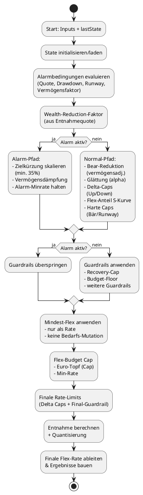

# Technische Dokumentation – Ruhestand-App-Final

Dieses Dokument beschreibt die Architektur und zentrale Datenflüsse der Ruhestand-App. Die Anwendung besteht aus zwei getrennten Oberflächen (Balance & Simulator) und einer gemeinsam genutzten Engine.

**Dokumentrolle:** Operative Entwickler-Referenz für aktuelle Modulzuständigkeiten, Datenflüsse und Laufzeitverhalten.
**Abgrenzung:** Vertiefte fachliche Herleitungen, Marktvergleiche und Forschungsabgleich stehen in `ARCHITEKTUR_UND_FACHKONZEPT.md`.
**Dokumentstand:** 2026-07-22; Codeabgleich bis Monte-Carlo-Hardening Slice 12 auf Commit `4cd9eeb` plus lokaler Abschlusskandidat.

---

## Architekturüberblick

### Komponenten

| Komponente | Dateien | Zweck |
|------------|---------|-------|
| Balance-App | `Balance.html`, `app/balance/*.js`, `css/balance.css` | Jahresabschluss, Liquiditäts- und Entnahmeplanung, Diagnosen, Ausgaben-Check mit Jahreshistorie |
| Simulator | `Simulator.html`, `app/simulator/*.js`, `simulator.css` | Monte Carlo, Backtest, Sweeps, Auto-Optimize, Stationary Bootstrap, Tail-Risk-Stresstest, Pflegefall- und Pflegebucket-Wirklogik |
| Profil/Verbund | `index.html`, `app/profile/*.js` | Profilverwaltung, Handoff/Flush, Profilverbund und Pflegebucket-Definition |
| Tranchen | `depot-tranchen-manager.html`, `types/tranche-contract.js`, `app/tranches/*.js` | Kanonischer Lotvertrag, CRUD/Recovery, EUR-Quotes, Consumerstatus und bestaetigter Realbestandsabgleich |
| Shared | `app/shared/*.js` | Gemeinsame Formatter, Feature-Flags, CAPE-Helfer, Persistenz-Facade |
| Engine | `engine/` (ESM) → `engine.js` | Validierung, Marktanalyse, diskrete und kontinuierliche Regime-Signale, VPW-Rendite-Policy, Spending- und Transaktionslogik |

Die Pfade und Contracts sind normativ; volatile Modul- und Testdateizaehler stehen im Coverage-Inventar statt in dieser Architekturreferenz.

Alle Skripte sind ES6-Module. Die Engine wird per `build-engine.mjs` mit esbuild (oder Modul-Fallback) gebündelt und stellt eine globale `EngineAPI` bereit.
Für CI/Release ist Strict-Mode vorgesehen (`npm run build:engine:strict`), der ohne `esbuild` fehlschlägt.

### Tauri Desktop-Build und Live-Daten

Die Desktop-App lädt das Frontend direkt aus `dist/` (`src-tauri/tauri.conf.json -> build.frontendDist = "../dist"`). Für Windows ist der praktische Build-Pfad:

1. `build-tauri.bat`
2. `scripts/build-tauri.ps1`
3. `npm run sync-dist`
4. `npm run tauri:build`
5. Archivierung einer vorhandenen `RuhestandSuite.exe` unter `release-archive/RuhestandSuite_yyyy-MM-dd_HH-mm-ss-fff.exe`
6. Kopie der erzeugten Binary nach `RuhestandSuite.exe`

Wichtig für Live-Daten:

* ETF-Kurse laufen in der EXE über den in `src-tauri/src/lib.rs` gestarteten lokalen Yahoo-Proxy auf `127.0.0.1:8787`.
* Im Jahresprozess kommt das ETF-Zieljahr aus `annualPeriodMetadata.pendingCommit.periodId`. Vor dem Fetch werden Schema-Version, Phase `writes_started`, Snapshot-ID, letzte Commit-Periode und bereits abgeschlossenes Zieljahr validiert. Der Chart-Abruf verwendet das UTC-Fenster 27.12. bis zum exklusiven 01.01. des Folgejahres und akzeptiert nur den letzten VWCE.DE-Schlusskurs von 0,50 bis 100.000 EUR vom 27.12. bis 31.12. des Zieljahres. Marktdateninputs und `annualMarketDataMeta` werden gemeinsam gespeichert; Metadaten führen Preis, ISO-Stichtag, Ticker, Quelle, Zieljahr, Perioden-ID und die stichtagsgleiche ATH-Auswertung. Fehler nach begonnener Marktdatenmutation rollen den lokalen DOM-/State-Schritt zurück, während der Jahres-Coordinator zusätzlich seinen Recovery-Snapshot behält.
* Inflation (ECB, World Bank, OECD) und CAPE (`r.jina.ai` -> Yale/Mirror) laufen in der EXE direkt aus der Tauri-WebView.
* Die dafür nötigen Ziele stehen explizit in `src-tauri/tauri.conf.json` unter `app.security.csp.connect-src`.
* Web-Worker laufen aus dem gebündelten Frontend und bleiben über `worker-src 'self' blob:` erlaubt.
* `dangerousDisableAssetCspModification` ist bewusst gesetzt, damit die handgepflegte CSP aus `tauri.conf.json` unverändert gilt und nicht durch Tauri-Asset-Rewrites erweitert wird. Breite Einträge wie `unsafe-inline`, `unsafe-eval` und Inline-Styles bleiben nur wegen bestehender HTML-/Modul-Patterns erlaubt und sind kein Freibrief fuer neue externe Quellen.
* In der Browser-Variante wird der Yahoo-Proxy weiterhin über `start_suite.cmd` / `start_suite.ps1` gestartet und benötigt dafür Node.js.

**Tauri-Yahoo-Proxy-Contract (`src-tauri/src/lib.rs`):**

* Bindet nur auf `127.0.0.1:8787`.
* Endpunkte:
  * `/quote?symbol=...` -> aktueller Preis, bevorzugt Yahoo Chart API, Fallback Quote API.
  * `/search?q=...` -> Yahoo-Suche.
  * `/chart?symbol=...&period1=...&period2=...&interval=...` -> Yahoo Chart API.
* CORS erlaubt Tauri-Urspruenge (`null`, `tauri://localhost`, `https://tauri.localhost`, `http://tauri.localhost`) sowie lokale Entwicklungsurspruenge auf `localhost`/`127.0.0.1`. Externe Origins erhalten `Access-Control-Allow-Origin: null`.
* Fehler werden als JSON gemeldet: fehlende Parameter mit `400`, nicht gefundene Preise mit `404`, Upstream-/JSON-Fehler mit `502`.
* London-Preise in GBp/GBX werden fuer `.L`-Symbole auf Pfund normalisiert.
* Wenn Port `8787` bereits belegt ist, wird der Proxy-Start geloggt abgebrochen; die Tauri-App selbst startet weiter, ETF-Live-Kurse koennen dann aber nicht ueber den integrierten Proxy geladen werden.

**Manuelle Desktop-Smoke-Checks nach `build-tauri.bat`:**

Nach einem erfolgreichen manuellen EXE-Build sollte die erzeugte `RuhestandSuite.exe` kurz geprueft werden:

1. EXE startet ohne separates lokales Webserver- oder Node-Proxy-Setup.
2. Startseite/Profilverwaltung laedt.
3. Balance-App laedt, fuehrt eine Aktualisierung aus und zeigt keine Asset-/Engine-Fehler.
4. Simulator laedt; ein kleiner Monte-Carlo- oder Backtest-Smoke-Lauf startet ohne Worker-Fehler.
5. Tranchenmanager laedt leere oder synthetische Tranchen ohne Fehler.
6. Handbuch laedt.
7. Optionaler Live-Daten-Check mit Internet: ETF-Kurs via integriertem Proxy, Inflation/CAPE via freigegebene Endpunkte.
8. Optionaler Offline-Check: Ohne Internet darf die lokale App nicht unbenutzbar werden; außerhalb eines bestätigten Jahres-Commits degradieren Live-Daten-Fetches als Fallback/Warnung. Ein bereits begonnener atomarer Jahres-Commit bleibt bei einem erforderlichen fehlgeschlagenen Periodenschritt bewusst im Recovery-Pfad, statt falsche Stichtagsdaten zu übernehmen.
9. Keine Log-/Console-Hinweise auf fehlende `dist`-Assets oder blockierte Worker.

---

## Engine

Die Engine besteht aus zentralen ES-Modulen, die von `build-engine.mjs` zu `engine.js` zusammengeführt werden. Die Reihenfolge entspricht zugleich der internen Verarbeitungskette:

1. **`engine/validators/InputValidator.mjs`** – prüft sämtliche Eingaben auf Vollständigkeit, Wertebereiche und Konsistenz. Liefert strukturierte Fehlermeldungen.
2. **`engine/analyzers/MarketAnalyzer.mjs`** – klassifiziert Marktregime, berechnet Drawdowns und leitet Kennzahlen für Guardrails ab. `marketDataStatus` unterscheidet `missing`, `partial` und `complete`; ohne positive endliche Werte fuer aktuellen Kurs und ATH bleiben ATH-Abstand und `seiATH` `null`, und fehlende Kerndaten verwenden `side_long` statt eines falschen ATH-Signals. CAPE bleibt unabhaengig auswertbar. Additiv liefert `engine/analyzers/regime-signals.mjs` kontinuierliche Signal-Severities fuer Drawdown, CAPE und Runway. Die Stuetzwerte bleiben richtungssensitiv: aufsteigende Skalen wie Drawdown und absteigende Skalen wie Runway duerfen nicht per `Math.min`/`Math.max` sortiert werden.
   - `engine/planners/vpw-return-policy.mjs` kapselt die erwartete VPW-Realrendite. `legacy_step` bleibt Default; `cape_continuous` ist ein expliziter Config-Modus mit robuster CAPE-Normalisierung, separaten Aktien-/Portfolio-Clamps und Diagnosefeldern.
3. **`engine/planners/SpendingPlanner.mjs`** – orchestriert die Entnahmeplanung aus State, Alarm, initialer Flex-Rate, Policy-Pipeline, Entnahmeberechnung, Result und Diagnose. Reine Policy-Helper liegen in `engine/planners/spending-policy-helpers.mjs`, die vermögensbasierte Reduktionsdämpfung in `engine/planners/wealth-reduction.mjs`, Alarm-Aktivierung und Deeskalation in `engine/planners/alarm-policy.mjs`, Flex-Rate/S-Kurve/harte Caps in `engine/planners/flex-rate-policy.mjs`, Mindest-Flex in `engine/planners/minimum-flex-policy.mjs`, Flex-Budget-Cap/Recharge/Min-Rate in `engine/planners/flex-budget-policy.mjs`, Recovery-/Caution-Guardrails und Budget-Floor in `engine/planners/spending-guardrails.mjs`, finale Rate-Limits in `engine/planners/final-rate-policy.mjs`, die stabile Post-Flex-Policy-Reihenfolge in `engine/planners/spending-policy-pipeline.mjs`, finale Diagnose- und Runway-Ziel-Strukturen in `engine/planners/spending-diagnosis.mjs`.

### Flex-Reduktion: Reihenfolge der Caps/Limits

Das folgende Flussdiagramm zeigt die Reihenfolge, in der die Flex-Rate angepasst und begrenzt wird. Entscheidend ist die Abfolge im `SpendingPlanner` (siehe `determineSpending()`):


```plantuml
@startuml
start
:Start: Inputs + lastState;
:State initialisieren/laden;
:Alarmbedingungen evaluieren\n(Quote, Drawdown, Runway,\nVermögensfaktor);
:Wealth-Reduction-Faktor\n(aus Entnahmequote);
if (Alarm aktiv?) then (ja)
  :Alarm-Pfad:\n- Zielkürzung skalieren\n  (min. 35%)\n- Vermögensdämpfung\n- Alarm-Minrate halten;
else (nein)
  :Normal-Pfad:\n- Bear-Reduktion\n  (vermögensadj.)\n- Glättung (alpha)\n- Delta-Caps\n  (Up/Down)\n- Flex-Anteil S‑Kurve\n- Harte Caps\n  (Bär/Runway);
endif
if (Alarm aktiv?) then (ja)
  :Guardrails überspringen;
else (nein)
  :Guardrails anwenden\n- Recovery-Cap\n- Budget-Floor\n- weitere Guardrails;
endif
:Mindest-Flex anwenden\n- nur als Rate\n- keine Bedarfs-Mutation;
:Flex-Budget Cap\n- Euro-Topf (Cap)\n- Min-Rate;
:Finale Rate-Limits\n(Delta Caps + Final-Guardrail);
:Entnahme berechnen\n+ Quantisierung;
:Finale Flex-Rate ableiten\n& Ergebnisse bauen;
stop
@enduml
```

`applyMinimumFlexFloor()` nutzt nur Spending-Layer-Daten. Der Schritt blockiert eine Anhebung bei aktivem Alarm, bei unzureichendem Gesamtvermoegen fuer Netto-Floor plus Mindest-Flex oder wenn der Mindest-Runway nach dieser Zahlung nicht mehr aus dem Gesamtvermoegen wiederherstellbar waere. Niedrige aktuelle Liquiditaet allein ist kein Blocker, solange der Gesamtvermoegens-Proxy ausreichend ist. Flex-Budget-Cap und finale Rate-Limits laufen danach weiter und duerfen die Anhebung begrenzen.
4. **`engine/transactions/TransactionEngine.mjs`** – leitet Ziel-Liquidität ab, steuert Puffer-Schutz und führt **Gap-basiertes Surplus-Rebalancing** (Investition nur bis Ziel-Allokation) durch.
   - Unterteilt in `engine/transactions/transaction-action.mjs`, `transaction-opportunistic.mjs`, `transaction-surplus.mjs`, `sale-engine.mjs`, `three-bucket-logic.mjs` und `transaction-utils.mjs` für Entscheidungslogik, Rebalancing-Pfade, Verkauf/Steuern, 3-Bucket-Jilge-Bond-Logik und Hilfsfunktionen.
   - `transaction-utils.mjs` stellt neben dem kompatiblen Zahlenwert auch `calculateTargetLiquidityDetails()` bereit. Die Details enthalten `runwayTargetDiagnostics` mit Rohziel, effektivem Ziel, Severity, Fallback-Grund und harter Mindest-Runway. Die Zielwert-Glaettung ist per `CONFIG.REGIME_SMOOTHING.TARGETS_ENABLED` geschaltet und bleibt im Default deaktiviert.
   - Detailtranchen-Verkaeufe geben `trancheId` und `sourceProfileId` in `breakdown[]` weiter, damit mehrprofilige Tranchen spaeter eindeutig und ohne Cost-Basis-Vermischung reduziert werden koennen.
   - Bond-/Anleihen-Tranchen werden ueber Typ oder Kategorie erkannt und im Modus `3_bucket_jilge` als defensiver Zwischenpuffer fuer schlechte Jahre und Bond-Refill in guten Jahren verwendet.
5. **`engine/core.mjs`** – orchestriert die oben genannten Module, exponiert `EngineAPI` (Version 31) und erzeugt Diagnose-/UI-Strukturen.
6. **`engine/tax-settlement.mjs`** – zentrale Jahressteuer-Settlement-Logik (Verlusttopf, SPB, finale Steuer).

Der Core reconciled den ersten Asset-Verkauf eines Jahres gegen das finale Jahres-Settlement. `steuerPlanGesamt` und `nettoErlösPlan` sichern die konservative Verkaufsplanung, `steuer` bleibt die finale Jahressteuer, und `taxCashAdjustment` gibt eine nicht benoetigte Steuerreserve genau einmal an `verwendungen.liquiditaet` zurueck. `bruttoVerkaufGesamt - steuer`, `nettoErlös` und die Summe der Verwendungen bleiben dadurch cashseitig konsistent. Die Steuer-/Nettofelder in `quellen` bzw. `breakdown[]` bleiben bewusst Planattribution. Die Reconciliation zusaetzlicher Simulator-Forced-Sales ist ein separater Mehrfachverkaufs-Contract.
7. **`engine/config.mjs`** – zentrale Konfiguration (Schwellenwerte, Regime-Mapping, Profile). Generiert zur Build-Zeit eine eindeutige Build-ID.
8. **`engine/errors.mjs`** – Fehlerklassen (`AppError`, `ValidationError`, `FinancialCalculationError`).


### Datenfluss innerhalb der Engine

```
Input → InputValidator.validate
      → MarketAnalyzer.analyzeMarket
      → SpendingPlanner.determineSpending
      → TransactionEngine.calculateTargetLiquidity + determineAction
      → tax-settlement (Jahresaggregation von Roh-Steuerdaten)
      → Ergebnisobjekt (UI-Daten, Diagnose, neuer State)
```

`simulateSingleYear()` gibt `{ input, newState, diagnosis, ui }` oder ein
`{ error }`-Envelope mit `ValidationError`/`AppError` zurück. Dieser Vertrag ist
methodenspezifisch: `analyzeMarket()` verwendet im Fehlerfall historisch
`{ error: <string> }`, `calculateTargetLiquidity()` besitzt kein eigenes
Catch-Envelope. Die UIs prüfen den jeweiligen Aufrufvertrag vor Rendering oder
Persistenz.

---

## Balance-App

**Pfadkonvention:** Die Balance-Module liegen unter `app/balance/`. Profilverbund-/Profilmodule liegen unter `app/profile/`, Shared-Utilities unter `app/shared/`.

### Modulübersicht

* `app/balance/balance-config.js` – Konfiguration, Fehlertypen, Debug-Utilities.
* `app/balance/balance-utils.js` – Formatierungs- und Hilfsfunktionen (shared-formatting, Threshold-Zugriff).
* `app/balance/balance-storage.js` – Balance-Persistenz ueber `app/shared/persistence-facade.js`, Jahresabschluss-Snapshots sowie bestaetigte `balance-import-recovery`-Punkte mit automatischem Import-Rollback ueber das interne Snapshot-Archiv.
* `app/balance/balance-reader.js` – liest Benutzerinputs aus dem DOM und setzt UI-Side-Effects.
* `app/balance/balance-health-bucket.js` – liest die Profildefinition des Pflegebuckets und erzeugt eine reine Diagnose zu Brutto-Liquidität, Pflege-Zweckbindung, operativer Liquidität, Zieldeckung und Freigabestatus.
* `app/balance/balance-renderer.js` – Darstellung der Ergebnisse (Summary, Guardrails, Entscheidungsdiagnose, Toasts, Themes).
* `app/balance/balance-binder.js` – Event-Hub mit Tastenkürzeln, schema-validiertem Balance-Import/Export, Snapshots und Debug-Modus.
* `app/balance/balance-main.js` – Orchestrator: initiiert Module, bindet beim Start einen kompatiblen Engine-Vertrag und führt `update()` aus.
* `app/balance/balance-update-pipeline.js` / `balance-action-postprocessor.js` – Fail-closed Engine-Handshake und Update-Statusvertrag sowie Pipeline-Helfer fuer Last-State-Vorbereitung, Single-Profil-Action-/3-Bucket-Postprocessing, unveraenderte Weitergabe finaler Profilverbund-Actions, Renderer-/Diagnose-Payload, Persistenz und Ausgabenbudget.
* `app/profile/profilverbund-action-attribution.js` – DOM-freie Profilattribution der finalen Haushaltsaktion inklusive globaler profilsteuer-aware Quellenplanung, Provenienzvalidierung, profilbezogenem Steuerabschluss, Quellen-/Verwendungs-Reconciliation und Abgleich der Liquiditaets-KPIs.
* `app/balance/balance-annual-marketdata.js` – Online-Marktdaten für Jahreswechsel: periodengebundener ETF-Jahresendkurs mit fail-closed Yahoo-Validierung und `annualMarketDataMeta` sowie davon unabhängiger CAPE-Fallback-Contract.
* `app/balance/balance-annual-period.js` – reiner Jahresperioden-Contract mit stabiler `calendar-year:<YYYY>`-ID, Legacy-Baseline, Planvalidierung, Doppel-Commit-Schutz und Recovery-Metadaten.
* `app/balance/balance-annual-orchestrator.js` / `app/balance/balance-annual-modal.js` – Jahreswechsel-Pipeline mit explizitem `ok`-/Fehlerergebnis und Ergebnisprotokoll; die Altersfortschreibung schreibt vor dem Profil-Sync auch `profile_aktuelles_alter`.
* `app/balance/balance-binder-snapshots.js` – Laufzeit-Coordinator fuer beide Jahres-Buttons: nebenwirkungsarme Engine-Vorpruefung, Pre-Mutation-Flush, validierter Recovery-Snapshot, persistierte Phasen `snapshot_confirmed`/`writes_started`/`validating`, fachliche Writes, Post-Write-Validierung und finaler Flush. Ein Pending-Commit blockiert weitere Jahresprozesse bis zum Snapshot-Restore.
* `app/balance/balance-expenses.js` – Controller/Fassade fuer den Ausgaben-Check: Initialisierung, Event-Wiring, CSV-Import-Ablauf, Jahrumschaltung und gesperrte Korruptions-Recovery-UI.
* `app/balance/balance-expenses-storage.js` / `balance-expenses-csv.js` / `balance-expenses-metrics.js` / `balance-expenses-renderer.js` – expliziter `ok`-/`empty`-/`corrupt`-Storagevertrag mit Recovery-Dokument, CSV-Parsing, Kennzahlen und DOM-Rendering des Ausgaben-Checks.

### Ablauf einer Aktualisierung

1. `balance-binder.js` reagiert auf Eingaben (Formular, Tastenkürzel, Buttons) und ruft `debouncedUpdate()` auf.
2. `balance-reader.js` sammelt alle Inputs und gibt ein strukturiertes Objekt zurück.
3. `balance-update-pipeline.js` prueft den beim Bootstrap gebundenen `EngineAPI.getVersion()`-/`simulateSingleYear()`-Contract und bereitet den Engine-Last-State inklusive Guardrail-Reset und Tax-State-Erhalt vor. Fehlende, inkompatible oder nach dem Handshake ausgetauschte Engines blockieren vor dem Lesen, Berechnen und Persistieren; ein laufender Script-Tag wird nicht nachtraeglich fuer Cache-Busting umgeschrieben.
4. `balance-main.js` reicht die Inputs erst nach erfolgreichem Gate an `EngineAPI.simulateSingleYear()` weiter. Im Multi-Profil-Fall entsteht genau ein Haushaltslauf mit dem profilmarkierten Haushaltstranchenpool; dessen Aktion wird genau einmal durch die Haushalts-3-Bucket-/Bond-Logik finalisiert.
5. `profilverbund-action-attribution.js` attribuiert die finalen Quellen und Verwendungen auf Profile, reconciliert die Profilsteuern und aktualisiert die Liquiditaets-KPIs. Es gibt keine technischen Profil-Engine-Laeufe. `balance-action-postprocessor.js` fuehrt nur im Single-Profil-Pfad 3-Bucket aus und reicht die Profilverbund-Aktion unveraendert weiter.
6. `balance-renderer.js` aktualisiert UI-Komponenten und Statusanzeigen mit dem Pipeline-Payload.
7. `balance-update-pipeline.js` kapselt Diagnose-Anreicherung, Persistenzentscheidung und Ausgabenbudget. `update()` gibt maschinenlesbar `success`, `validation_error`, `engine_error` oder `blocked` zurueck; `ok` bleibt als Kompatibilitaetswert fuer bestehende Jahresabschluss- und Importaufrufer erhalten. Persistenz ist nur im `success`-Pfad erlaubt.

### Empfehlung und realer Tranchenbestand

Balance- und Simulatorergebnisse sind beratende Rechenergebnisse. Berechnung,
Rendering, Seitenwechsel und Jahres-Update schreiben niemals Verkaufsempfehlungen
in `depot_tranchen` zurueck. `Balance.html` verweist deshalb nach einer tatsaechlichen
Broker-Ausfuehrung auf den getrennten Profil-Assets-Manager.

Der einzige produktive Pfad fuer eine reale Verkaufsfortschreibung liegt in
`app/tranches/tranche-reconciliation.js` und der bestaetigenden UI in
`app/tranches/tranchen-manager-page.js`:

1. Die Eingabe nennt `profileId`, `trancheId` und eine stabile `actionId` explizit;
   Namen, Praefixe und Stringsuffixe werden nicht zur Aufloesung verwendet.
2. Eine reine Vorschau zeigt alten Bestand, tatsaechliche Stueckzahl,
   Bruttoerloes, Kosten, Nettoerloes und resultierenden Bestand. Abbruch und
   identische Wiederholung sind schreibfrei.
3. Erst die separate Dauerbestaetigung reduziert bei einem Teilverkauf
   Stueckzahl, Marktwert und Cost Basis proportional. Ein Vollverkauf entfernt
   genau das gewaehlte Lot; negative Restwerte und Ueberverkaeufe sind blockiert.
4. Vor jedem Write muessen aktives Profil, aktuelles Profil, Profilregistry,
   Live-Tranchenpayload und der bei der Vorschau gelesene Payload zusammenpassen.
   Ein Profilwechsel oder veralteter Stand bricht fail-closed ab.
5. Live-Bestand, profilgebundener Bestand und Idempotenz-/Auditdatensatz werden
   ueber die bestehende `PersistenceFacade` in einem Flush geschrieben. Bei
   Flushfehler werden die vorherigen Cachewerte wiederhergestellt und dieselbe
   bestaetigte Aktion bleibt retryfaehig.

Der datensparsame Verlauf liegt als `trancheReconciliation` auf oberster Ebene
der bestehenden Profilregistry `rs_profiles_v1`. Er enthaelt Action-, Profil- und
Tranche-ID, Ausfuehrungstag, tatsaechliche Menge/Erloes/Kosten, optional die vom
Nutzer erfasste Empfehlungsreferenz, resultierende Stueckzahl und Commit-Zeit.
Tranchennamen, ISIN, Ticker, Notizen oder exportierte Rohdaten werden nicht
dupliziert. Eine identische `actionId` mit denselben Daten ist ein No-op; dieselbe
ID mit abweichenden Daten ist ein Konflikt.

### Entscheidungsdiagnose (Balance)

Die Balance-App bezeichnet das Diagnose-Panel als `Entscheidungsdiagnose`, um die regelbasierte, pruefbare Logik klar von einer Blackbox-Interpretation abzugrenzen.

* `balance-diagnosis-format.js` normalisiert Guardrail-Zustaende und fuegt Grenzfallhinweise hinzu. Exakt erfuellte Mindestschwellen werden als `ok` behandelt und mit Texten wie `Exakt auf Mindestniveau` erklaert.
* `balance-diagnosis-transaction.js` rendert Transaktionsstatus, Schwellen und Erklaerkarten wie `Warum kein Goldkauf?`, wenn Zielwerte sichtbar sind, aber keine Aktion ausgelöst wird.
* `balance-diagnosis-keyparams.js` trennt Dynamic-Flex-Begriffe in `VPW-Rahmen`, `Statischer Flex-Bedarf`, `Flex freigegeben` und `Nicht genutzter Rahmen`, damit ein hoher VPW-Rahmen nicht als Konsumauftrag missverstanden wird.
* Regime-Smoothing-Felder werden als Erklaerung, nicht als Blackbox-Score gerendert: `runwayTargetSmoothing` zeigt Rohziel, Effektivziel, Drawdown-Severity, Stuetzwerte, Fallback und harte Mindestgrenze. Fallbacks werden nicht als angewandte Glaettung beschriftet.
* `balance-renderer-action.js` zeigt weiterhin Quellen und Verwendungen, ergänzt aber eine aggregierte Sicht `Plan nach Zweck` fuer Liquiditaet, Gold, Aktien, Geldmarkt, Bonds, Steuer und Rest/Puffer.

### Ausgaben-Check (Balance)

Der Ausgaben-Check verwendet einen separaten lokalen Datenspeicher (`balance_expenses_v1`) mit Jahrescontainer. Der Controller liegt in `app/balance/balance-expenses.js`; Storage-, CSV-, Metrik- und Rendering-Details sind in `balance-expenses-*` Module ausgelagert:

* `years[YYYY].months[1..12].profiles[profileId]` speichert importierte Kategorien je Monat/Profil.
* `activeYear` steuert, welches Jahr im Tab angezeigt wird.
* Beim Jahresabschluss muss der Ausgaben-Check auf dem abgeschlossenen Vorjahr stehen. Nach erfolgreicher Periodenvalidierung wird er auf `activeYear + 1` gestellt; bestehende Jahresdaten bleiben unverändert als Historie erhalten.
* JSON-, Schema- und Storage-Lesefehler werden nicht als leerer Store normalisiert. Der Rohinhalt bleibt unveraendert, normale Writes sind gesperrt und die UI nennt Datenbereich sowie aktives Backend.
* Der Reset ist zweistufig: Recovery-Rohdaten exportieren, dann explizit bestaetigen. Erst ein erfolgreicher Persistenz-Flush verlaesst den Recovery-Zustand; bei Flush-/Quota-Fehler wird der korrupte Rohinhalt im aktiven Store wiederhergestellt.

Die Kennzahlen im Tab berechnen sich wie folgt:

* `Monatssumme`: Summe aller Profil-Ausgaben des Monats.
* `Jahresrest`: `annualBudget - annualUsed`.
* `Hochrechnung`: bei 1 Datenmonat `Ø/Monat * 12`, ab 2 Datenmonaten `Median/Monat * 12`.
* `Soll/Ist`: basiert auf importierten Monaten (`monthlyBudget * monthsWithData`) statt auf Kalendermonaten.

### Jahreswechsel mit Auto-CAPE

Der Jahreswechsel ruft CAPE automatisiert und fehlertolerant ab:

* Quelle/Fallback: Yale (Primary) -> Mirror (`shillerdata`) -> letzter gespeicherter Wert.
* Requests laufen mit eigenem Timeout; Abort-/Timeout-Fehler werden in nutzbare Statusmeldungen übersetzt.
* Persistente Meta-Felder: `capeAsOf`, `capeSource`, `capeFetchStatus`, `capeUpdatedAt`.
* Der Ablauf ist non-blocking: fehlende CAPE-Daten werden als Warnung protokolliert, der Jahreswechsel läuft weiter.
* Vertragsdetails und Fehlerszenarien: `docs/internal/archive/2026-dynamic-flex/CAPE_AUTOMATION_CONTRACT.md`.

### Pflegebucket-Diagnose (Balance)

Die Balance-App ist aktuell Consumer der Profildefinition, aber nicht der operative Freigabeort des Pflegebuckets. `balance-reader.js` liest die gespeicherte Definition aus `profile_health_bucket`; `balance-health-bucket.js` berechnet daraus Diagnosewerte:

* `grossLiquidity`: operative Liquidität plus gesperrter Pflegebucket.
* `lockedAmount`: als Pflege-Zweckbindung reservierter Betrag.
* `lockedFromMoneyMarket` und `lockedFromCash`: Herkunft der Reserve, soweit aus Profil-/Tranchenwerten ableitbar.
* `operativeLiquidity`: frei verfügbare Liquidität nach Abzug der Zweckbindung.
* `targetInflationAdjusted`, `coveragePct`, `gap`: inflationsbezogene Zieldeckung.
* `releasePolicy: 'diagnostic_only'`, `releaseAllowed: false`, `releasedAmount: 0`: expliziter Contract, dass Balance den Bucket in Version 1 nicht automatisch entsperrt.

Diese Grenze ist fachlich gewollt: Balance kennt derzeit keinen belastbaren aktuellen Pflegegrad-Ist-Zustand. Reale Pflegeausgaben werden weiterhin über Bedarfswerte/Jahresplanung abgebildet; der Bucket bleibt transparent als Zweckbindung sichtbar.

---

## Simulator

**Pfadkonvention:** Die Simulator-Module liegen unter `app/simulator/`. Profil-/Verbundmodule liegen unter `app/profile/`, gemeinsame Utilities unter `app/shared/`, Tranchen-Status unter `app/tranches/`.

### Wichtige Module

* `app/simulator/simulator-main.js` – zentrale Steuerung, Parameter-Sweep-Logik, Self-Tests.
* `app/simulator/simulator-monte-carlo.js` – UI-Koordinator für Monte-Carlo (liest Inputs, setzt Progress, orchestriert Runner/Analyzer) inkl. generationengebundenem Single-Flight-Start/-Abbruch, Worker-Orchestrierung und Erzeugung des versionierten Run-/Result-/Provenienzexports.
* `app/simulator/monte-carlo-parameters.js` – DOM-freier `MonteCarloParametersV1`- und Ressourcenvertrag fuer Runzahl, Mortalitaetshorizont, Blocklaenge, Seed, Enums, Startjahrgewichtung, Workerzahl und Jobbudget. Er liefert ausserdem Run-Jahre, gemessene Ergebnis-Payload-Schaetzung, Speicherklasse und die Grosslastschwelle; UI, direkter Runner, Worker und Auto-Optimize verwenden denselben Validator ohne `parseInt`-Teilannahmen oder stilles Klemmen.
* `app/simulator/mc-run-context.js` – DOM-freie Chunk-Kontext-Erzeugung fuer Monte-Carlo (RunRange, RNG-Modus, Buffers, Progress-Intervall, LogIndexSet und Sampling-Konfiguration).
* `app/simulator/mc-year-sampling.js` – DOM-freier `MonteCarloSamplingContractV1` fuer Startjahr-/CAPE-Praezedenz, methodenspezifische Jahr-1-Regeln, FILTER-/RECENCY-CDF, Estimated-History-Filter sowie kompakte, merge-invariante `MonteCarloSamplingDiagnosticsV1`.
* `app/simulator/mc-life-events.js` – DOM-freie Life-State-Initialisierung fuer Monte-Carlo (Care-Meta, Partnerstatus, Care-RNGs, Alive-Initialwerte, HouseholdContext) sowie gemeinsamer fail-closed Mortalitaets- und Horizon-/Altersgrenzvertrag; per-year Life-Events bleiben aus Performance-Gruenden im Runner-Hot-Path.
* `app/simulator/mc-stress-tracker.js` – DOM-freie Stress-Metrik-Kapselung fuer Monte-Carlo (Stress-Drawdown, Quote-Above-4.5, Cut-Years, runbasierte reale Depotentnahme P10, Recovery-Years). Nach Ruin werden Nullentnahmen im festen Stressfenster fortgeschrieben.
* `app/simulator/mc-log-builder.js` – DOM-freie Monte-Carlo-Logzeilen-Builder fuer Ruin-, Jahres- und Todesfall-Logs mit zentralen Alive-/Care-Feldern.
* `app/simulator/mc-run-metrics.js` – DOM-freie Run-Ende-Metrikfortschreibung fuer Monte-Carlo (Ergebnisbuffer, Pflege-Listen, Pflegebucket-Listen, Safety-Run-Zaehler, Worst-Runs, `runMeta`).
* `app/simulator/monte-carlo-runner.js` – DOM-freie Simulation (Jahresschleife, Pflege-KPIs) auf Basis von `simulator-engine-wrapper.js`. Unterstützt eine **Ansparphase** mit dynamischem Übergang in die Rentenphase (via `effectiveTransitionYear`) und klassifiziert jeden Run chronologisch genau einmal als `ruin`, `all_dead`, `horizon_exhausted` oder `technical_error`.
* `app/simulator/monte-carlo-chunk-result.js` – `MonteCarloChunkResultV1`, global indexierte Path-Summaries, `MonteCarloOutcomeInventoryV1` und validierte Samplingdiagnostik. Der Contract prueft Outcome-Summe, Ruinzaehler, technische Missingness und Worker-/Chunkparitaet; Dauer und Erschoepfungsalter nutzen `Uint32` sowie eine separate Missingness statt des frueheren 255-Sentinels.
* `app/simulator/monte-carlo-statistics.js` – reine Statistikhelfer fuer binaere Anteilschaetzer mit Wilson-95-Prozent-Intervall und fuer die gleichgewichtete Aggregation eines realen Depotentnahme-P10-Skalars je Run einschliesslich Missingness-Inventar.
* `app/simulator/monte-carlo-contracts.js` – DOM-freie, fail-closed Validatoren und Builder fuer `MonteCarloRunRequestV1` und `MonteCarloRunResultV1`, Replay-Projektion, Einheiten-/Missingnessvertrag sowie Snapshotpolicy. Das befristete Legacy-Read-Aliasregister ist seit Slice 11 leer; entfernte KPI-Keys werden nicht mehr erkannt oder telemetriert.
* `app/simulator/monte-carlo-export.js` – DOM-freier `MonteCarloExportV1`-Serializer/Reader mit kanonischem SHA-256-Fingerprint, Request-/Run-ID, App-/Engineprovenienz, Forward-Policy und sicherem Downloadnamen.
* `app/simulator/dynamic-flex-longevity-contract.js`, `dynamic-flex-longevity-horizon.js` und `dynamic-flex-runner-horizon.js` – DOM-freier Contract, Horizon-Adjustment und Runner-Resolver fuer konservativere Dynamic-Flex-Langlebigkeitsannahmen.
* `app/simulator/monte-carlo-ui.js` – UI-Fassade für semantische Progressbar, Live-Status, Fokusziele, Start-/Cancelzustand, striktes Parameter-Lesen, Kostenschaetzung, einmalige Grosslastbestaetigung und den ausschliesslich nutzergetriggerten V1-JSON-Download; erlaubt Callbacks ohne DOM-Leaks.
* `app/simulator/scenario-analyzer.js` – waehlt waehrend der Simulation bis zu 31 Szenarien (Worst, Perzentile, getrennte P1-/P2-Pflegefaelle, Zufall) aus.

* `app/simulator/simulator-engine-wrapper.js` – Facade für Engine-Aufrufe (verwendet `simulator-engine-direct.js`).
* `app/simulator/simulator-engine-direct.js` – Direkte Anbindung an die EngineAPI; nutzt den Pflegebucket vor Forced-Sale-Liquiditätsdeckung und spiegelt den kanonischen App-Inflationsfaktor in den Engine-Jahresstate.
* `app/simulator/simulator-health-bucket.js` – DOM-freie Pflegebucket-Logik für Trigger, Deckungsbedarf, Bucket-Verbrauch, Verzinsung und inflationsindexierte Diagnosen.
* `app/simulator/simulator-year-portfolio.js` / `simulator-household-pension.js` / `simulator-engine-input.js` / `simulator-accumulation-year.js` / `simulator-tax-recompute.js` / `simulator-forced-sale.js` / `simulator-bond-refill.js` / `simulator-year-result.js` – DOM-freie Hilfsmodule fuer Markt-/Portfoliofortschreibung, Renten-/Haushaltsberechnung, EngineAPI-Input-Mapping, Ansparjahre, Tax-Recompute, Forced-Sale-Liquiditaetsdeckung inklusive Payout-Fallback, Bond-Refill und finalen Rueckgabe-/Logdatenaufbau innerhalb eines Simulationsjahres. `simulator-accumulation-year.js` führt den App-Inflationsfaktor auch ohne Entnahme fort; `simulator-year-result.js` deflationiert die effektive Entnahme mit dem aktuellen Faktor und erzeugt den genau einmal fortgeschriebenen Folgejahresstate sowie die flachen Entnahme-/Payout-/VPW-Logfelder.
* `app/simulator/simulator-portfolio.js` – Initialisierung, Portfolio-Berechnungen, Stress-Kontexte.
* `app/simulator/simulator-results.js` – Aggregiert MC-Ausgaben und delegiert an `results-metrics.js` / `results-renderers.js` / `results-formatting.js`.
* `app/simulator/simulator-sweep.js` – Sweep-Logik inkl. Whitelist/Blocklist, Heatmap und Worker-Orchestrierung.
* `app/simulator/sweep-runner.js` – DOM-freier Sweep-Runner (kombinierbar in Worker-Jobs).
* `app/simulator/simulator-optimizer.js` – Auto-Optimize-Kernlogik; Kandidatensuche und Bewertung laufen mehrphasig über LHS-Kandidaten, Quick-Filter, volle Evaluation, lokale Verfeinerung und Validierung.
* `app/simulator/auto_optimize.js` – Auto-Optimize-Orchestrator inkl. Worker-Parallelisierung, Kandidatenbewertung und Champion-Auswahl.
* `app/simulator/auto_optimize_ui.js` und `app/simulator/auto-optimize-{presets,param-meta,config-ui,renderer,apply}.js` – Auto-Optimize UI-Fassade, Preset-Konfigurationen, Config-Parsing, Ergebnis-Rendering und Champion-Apply-Flow (1-7 dynamische Parameter).
* `app/simulator/simulator-heatmap.js` – SVG-Rendering für Parameter-Sweeps inkl. Warnhinweise bei Verstößen.
* `app/simulator/simulator-utils.js` – Zufallszahlengenerator, Statistikfunktionen, Parser (Formatierung über `app/shared/shared-formatting.js`).
* `app/shared/shared-formatting.js` – gemeinsame Formatter für Balance und Simulator (Währung, Prozent, Monate).
* `app/shared/persistence-facade.js` – synchrone In-Memory-Persistenz-Fassade mit Runtime-Adapter-Aufloesung, debounced/serialisiertem Flush, Legacy-Migration und Statusauskunft.
* `app/shared/persistence-adapter-localstorage.js` – Legacy-Adapter, der localStorage an das Adapter-Interface anbindet.
* `app/shared/persistence-adapter-indexeddb.js` – Browser-Adapter fuer Phase 2; im Browser ist IndexedDB die lokale Source of Truth, sofern verfuegbar.
* `app/shared/persistence-adapter-tauri.js` – Tauri-Dateiadapter fuer Phase 3; liest/schreibt `ruhestand_suite_data.json` ueber Custom Rust Commands.
* `app/shared/persistence-key-policy.js` – Allowlist fuer Erstmigration, Restore und Import aus Legacy-/Fremdquellen.
* `app/shared/persistence-backup.js` – Zentrales Modul fuer Komplett-Export und Komplett-Import der Persistenzdaten mit Prototype-Pollution-Haertung.
* `app/shared/runtime-env.js` – Laufzeiterkennung fuer Browser/Tauri-Featureauswahl.
* `app/simulator/simulator-data.js` – Historische Daten (inkl. 1925-1949 Schwarze-Schwan-Erweiterung), tief eingefrorenes `HistoricalDataManifestV1`, Mortalitäts- und Stress-Presets.
* `app/simulator/historical-backtest-contract.js` – DOM-freier, im Produktbacktest aktivierter Manifest-/SHA-256-/`HistoricalYearRecordV1`-Contract. Validiert das Dataset einmal je Revision/Hash, liefert immutable Records und prueft Einzelpfad- bzw. Cohort-Batch-Perioden vor der Rechenschleife. Die aktive Zeitachse `realized_t_decision_t_minus_1_v1` verwendet realisierte Markt-/Makrowerte aus `t` und CAPE decision-as-of aus `t-1`.

Browser-Persistenz seit Phase 2:

* App-Einstiegspunkte rufen `PersistenceFacade.init()` vor fachlichen Storage-Reads auf.
* Im Browser wird automatisch IndexedDB genutzt; beim ersten Start migriert die Facade erlaubte Legacy-Keys aus `localStorage`.
* IndexedDB nutzt die Datenbank `ruhestand-suite` in Version 2 mit den Stores `kv`, `metadata` und `snapshots`. Live-Daten liegen in `kv`; Jahresabschluss-Snapshots liegen im separaten Store `snapshots`.
* Das optionale File-System-Verzeichnis-Handle liegt getrennt in `ruhestand-suite-snapshot-handles`/`handles`. Beim ersten Zugriff wird ein vorhandenes `snapshotDirHandle` aus der historischen `snapshotDB` kopiert und die Legacy-Verbindung vor deren Archiv-Cleanup geschlossen.
* Nach erfolgreicher Migration markieren `ruhestandsapp_migrated_to_target`, `ruhestandsapp_migration_completed_at` und `ruhestandsapp_migration_checksum` den Legacy-Stand.
* Ist IndexedDB spaeter leer, obwohl der Marker vorhanden ist, wird nicht still aus altem `localStorage` zurueckmigriert; die Facade setzt stattdessen eine Migration-Warnung.
* Nach `PersistenceFacade.init()` wird `persistence:initialized` gesendet, damit frueh instanziierte Module wie Feature-Flags aus dem aktiven Backend neu laden koennen.
* Persistenz-Record-Maps werden defensiv als Null-Prototyp-Objekte gefuehrt, damit Daten-Keys wie `__proto__` nicht auf Objekt-Prototypen wirken.
* Tauri nutzt seit Phase 3 JSON-Dateien im App-Datenverzeichnis. Live-Daten liegen in `ruhestand_suite_data.json`; Jahresabschluss-Snapshots liegen getrennt in `ruhestand_suite_snapshots.json` und werden ueber das Adapter-Target `snapshots` geladen/gespeichert. Die Rust-Seite stellt `load_app_state`, `save_app_state`, `quarantine_app_state` und `confirm_app_close` bereit.
* Beim ersten Tauri-Start migriert die Facade erlaubte Legacy-Keys aus der WebView-`localStorage`-Ablage in die JSON-Datei und setzt denselben Migrationsmarker mit Target `tauri-json-file`.
* Beim nativen Fensterschluss verhindert Rust das sofortige Schliessen, sendet ein Frontend-Event, wartet auf den Facade-Flush und schliesst nach `confirm_app_close`. Um Hänger auf Seiten ohne Persistenz (z. B. Handbuch) oder bei WebView-Fehlern zu vermeiden, gibt es einen 3-Sekunden-Fallback in Rust, der das Schließen erzwungen durchführt.
* Korruptes Tauri-JSON wird quarantiniert; die Facade startet mit leerem Cache und Recovery-Warnung statt eine stille Rueckmigration oder einen White-Screen zu erzeugen. `Balance.html` rendert `getPersistenceStatus().migrationWarning` beim Start mit betroffenem Gesamtspeicher, Backend und Recovery-Hinweis, ohne den lokalen Quarantaenepfad auszugeben.

Snapshot-Archiv seit Jahresabschluss-Snapshot-Slice:

* `app/shared/snapshot-archive.js` definiert das kanonische Schema `persistence-records-v1` mit `schemaVersion`, `id`, `kind`, `createdAt`, `label`, `activeProfileId`, `recordCount`, `records` und `restoreScope`.
* `listSnapshots()` liefert nur Indexdaten ohne `records`; Vollpayloads werden erst per `readSnapshot(id)` gelesen.
* Capture schliesst alte Snapshot-Keys aus, damit Archivdaten nie in neue Live-Snapshots eingebettet werden.
* Standard-Restore schreibt nur erlaubte Live-Keys zurueck, erhaelt Profil-Registry und Snapshot-Historie, setzt das aktive Profil und bricht ab, wenn `snapshot.activeProfileId` in der aktuellen Registry nicht mehr existiert.
* Legacy-Snapshots mit Prefix `ruhestandsmodell_snapshot_` werden in das kanonische Archiv migriert. Eintraege ohne eindeutige aktive Profilzuordnung bleiben lesbar, werden aber nicht als Standard-Restore-faehig angezeigt.
* Das anschliessende Loeschen der historischen `snapshotDB` ist begrenzt: Ein `onblocked` beendet den Lauf mit einem retry-faehigen Report statt `listSnapshots()` oder den Jahresprozess aufzuhalten; erst ein erfolgreicher Delete schreibt den Cleanup-Marker.

Balance-JSON-Import seit Hardening-Slice 08:

* Das aktuelle Dateiformat verwendet `appId: "ruhe-stand-suite.balance"`, `schema: "balance-state"`, `schemaVersion: 1`, die informative `appVersion`, `exportedAt` und `payload`.
* Pflichtfelder `inputs.aktuellesAlter`, `inputs.floorBedarf` und `inputs.flexBedarf`, nichtnegative finanzielle Kernwerte, Mindest-Flex-Grenze sowie optionale `lastState`-Kernwerte werden rein validiert, bevor DOM oder Persistenz erreicht werden. Unversionierte Rohobjekte werden nicht als Legacy erraten.
* Explizite Legacy-Migration existiert nur fuer die frueher exportierten Envelopes v21.1 und v22.0 mit passender App-ID. Historische Inflations-/Tax-State-Fehlwerte werden in diesem benannten Migrationspfad normalisiert; unbekannte Versionen blockieren.
* Ablauf: Datei parsen und normalisieren -> importierte Eingaben temporaer anwenden -> `update({ persist: false })` muss `ok: true` liefern -> Facade flushen -> Recovery-Snapshot schreiben und zuruecklesen -> nur `CONFIG.STORAGE.LS_KEY` per `replaceLiveRecords()` ersetzen -> persistentes `update()` muss erfolgreich sein. Ein spaeter Fehler stellt den vollstaendigen Recovery-Snapshot und den vorherigen DOM-Zustand wieder her.
* Snapshot-/Quota-/Adapterfehler blockieren vor dem Balance-Replace. Fehlermeldungen verwenden feste Ursachen und Handlungsoptionen; Rohpayloads und Parserdetails werden nicht angezeigt.
* Der Reject-Rollback restauriert Werte normaler Inputs, aber nie einen nichtleeren Wert eines Datei-Inputs. Der Browser darf `#importFile` nur auf den leeren Wert zuruecksetzen; dadurch bleibt die sichere Fehlermeldung auch bei nativem File-Input-Verhalten erreichbar.

### Dynamic-Flex (VPW) Pipeline

Dynamic-Flex ist entlang der Simulator-Pipeline konsistent aktiviert:

* UI/Profile: `app/simulator/simulator-main-dynamic-flex.js`, `app/simulator/simulator-profile-inputs.js`.
* Input-Layer: `app/simulator/simulator-portfolio-inputs.js` normalisiert `dynamicFlex`, `horizonYears`, `horizonMethod`, `survivalQuantile`, `goGoMultiplier` sowie die Longevity-Felder `longevityMode`, `longevityQuantileShift`, `longevityRelativePct` und `longevityBufferYears`.
* Backtest/MC: `app/simulator/historical-backtest-contract.js` stellt den aktiven, gecachten Backtest-Daten-/Jahrescontract mit abgeleiteten Bounds und vollstaendigem Perioden-/Lookback-Preflight bereit. `app/simulator/historical-backtest-runner.js` baut `yearData` ausschliesslich aus diesen validierten Records, fuehrt die historische Jahresschleife DOM-/Persistenz-frei mit injiziertem `simulateOneYear()` und eigenen kanonischen Laufkopien aus und liefert bei Datenluecken vor dem Loop `incomplete`; `app/simulator/simulator-backtest.js` bleibt UI-/Projektionsadapter. Negative Cashzinsen bleiben in `simulator-engine-direct.js` und `simulator-year-result.js` als angewandtes Delta signiert, damit der Balance-Trace und `portfolio_flow_delta` mit der bilanziellen Liquiditaet uebereinstimmen. Monte Carlo, Sweep und Worker konsumieren diesen Backtestrecord nicht. `app/simulator/mc-run-context.js` bereitet den Chunk-Kontext vor; `app/simulator/mc-life-events.js` initialisiert den Life-State; `app/simulator/mc-stress-tracker.js` kapselt Stress-Metriken; `app/simulator/mc-log-builder.js` baut Monte-Carlo-Logzeilen; `app/simulator/mc-run-metrics.js` schreibt Run-Ende-Metriken fort; `app/simulator/monte-carlo-runner.js` berechnet den Raw-Horizont pro Simulationsjahr neu (Alter steigt im Loop) und wendet Longevity-Adjustment danach genau einmal auf den finalen Haushalts-Horizont an.
* Backtest-Metriken/Cohorts: `app/simulator/historical-backtest-metrics.js` definiert 24 versionierte Metriken mit Einheiten, Nennern, Missingness-, Outcome- und Rohquellenregeln und leitet sie ohne Displayrundung aus dem kanonischen Resultat ab. `app/simulator/historical-backtest-cohorts.js` erzeugt feste inklusive Fenster ueber einen einzigen Batch-Preflight, inventarisiert Outcomes und Ausschluesse getrennt und kennzeichnet die ueberlappenden Fenster als historische In-sample-Diagnose ohne Erfolgswahrscheinlichkeitsaussage.
* Backtest-Export: `app/simulator/historical-backtest-export.js` ist DOM-frei und serialisiert ausschliesslich `BacktestRunResultV1`. `HistoricalBacktestExportV1` (`schemaId=de.ruhestandsapp.historical-backtest.raw`) fuehrt Request-/Run-ID, Dataset-Content-/Manifest-Hash, Temporal-Konvention, Engine-Build und Config-Fingerprint, Outcome, sichere Fehlerdaten, Portfolio-Snapshots, Historical-Year-Records, Rohjahreszeilen, Metriken und optional ein Cohort-Inventar. Der SHA-256-Result-Fingerprint verwendet kanonisches JSON; `exportedAt`, IDs, Exportmetadaten und interne `diagnostics` sind ausgeschlossen. UI, Summary, Tabelle und Export teilen dieselbe tief eingefrorene Result-/Row-Instanz.
* Monte-Carlo-Export: `MonteCarloRunRequestV1` friert normalisierte Szenarioeingaben, Seed, Sampling-/Stressvertrag, Datenfingerprint sowie die tatsaechlich verwendete Worker-/Chunkkonfiguration ein. `MonteCarloRunResultV1` projiziert das disjunkte Outcome-Inventar, explizit benannte Nominal-/Real-EUR-KPIs, Stichprobengroessen, Missingness, Unsicherheit, Sampling-/Ausfuehrungsdiagnostik und sanitizierte technische Fehler. `MonteCarloExportV1` (`schemaId=de.ruhestandsapp.monte-carlo.run`) ergaenzt App-, Engine- und Snapshotprovenienz; sein SHA-256-Run-Fingerprint schliesst nur Exportzeit, IDs und reine Export-/Privacy-Metadaten aus. Unbekannte Zusatzfelder werden nach erfolgreicher V1-Pflichtfeldpruefung inventarisiert, unbekannte Schemaversionen und Fingerprintabweichungen fail-closed abgewiesen. Seit Slice 11 schreiben und lesen produktive V1-Consumer ausschliesslich kanonische KPI-Felder; das Legacy-Read-Aliasregister ist leer.
* Backtest-CSV: `HistoricalBacktestCsvV1` verwendet feste technische Header mit Einheiten, Semikolon, Punkt als Dezimaltrenner, LF und leere Missingness-Zellen. Textfelder erhalten Formel-Injektionsschutz und RFC-artiges Quote-/Delimiter-/Newline-Escaping. Displayformatter und der Detailtoggle werden nicht konsumiert. Der Download bleibt eine explizite Nutzeraktion ohne automatische Persistenz oder Uebertragung.
* Backtest-UI/A11y: `app/simulator/historical-backtest-ui.js` kapselt manifestabgeleitete Periodengrenzen, feldnahe Integer-/Bounds-Validierung, sanitizierte Statusprojektion, Datenqualitaets-/In-sample-Hinweise, das immutable Cohort-Inventar sowie Caption-/Header-Semantik der scrollbaren Tabelle. `simulator-backtest.js` injiziert im Browser-Gate Provider und Jahresadapter, ohne den produktiven Runnervertrag zu umgehen. Der Status unterscheidet `running`, `completed`, `ruin`, `incomplete`, `technical_error` sowie reine `validation_error` und verschiebt den Fokus nur nach explizitem Lauf oder auf das erste fehlerhafte Feld. Der Startbutton wird ausschliesslich per Modulhandler gebunden; Inline-`onclick` existiert nicht mehr.
* Worker-Parität: `workers/mc-worker.js` erhält dieselben Dynamic-Flex Inputs; Seed/Chunking bleiben deterministisch.
* Longevity-Modi: `none` ist Default; `quantile_shift`, `relative_horizon_buffer` und `buffer_years` sind explizite konservative Modi. Bei Paaren wird erst der Joint-Horizon bestimmt und danach einmal gepuffert. Beim Joint-to-Single-Uebergang kann eine lineare Floor-Glaettung grosse Horizontspruenge im MC-Lauf dämpfen und diagnostizieren.
* Sweep/Heatmap: `app/simulator/sweep-runner.js` validiert Invariants; invalid Kombinationen werden markiert statt gerechnet. Longevity-Werte werden aus den Basisinputs geerbt, aber in Version 1 nicht als Sweep-Variationsparameter zugelassen.
* VPW-Return-Policy: `CONFIG.SPENDING_MODEL.DYNAMIC_FLEX.RETURN_POLICY` akzeptiert `legacy_step` und `cape_continuous`. Der Default bleibt `legacy_step`; Continuous wird nicht ueber Profile oder Auto-Optimize optimiert und muss bewusst per Config aktiviert werden.
* Auto-Optimize: Dynamic-Flex-Basisparameter `horizonYears`, `survivalQuantile` und `goGoMultiplier` koennen optimiert werden; Longevity-Felder bleiben fixe Sicherheitsparameter und werden weder als Parameteroption noch per Champion-Apply ueberschrieben.
* Diagnose: `result.ui.vpw` enthaelt neben Rate und Flex-Betrag auch `returnPolicy`, `expectedReturnSource`, `capeInputStatus`, `expectedRealReturnRaw`, `expectedRealReturnClamped`, `safeRealReturn`, `safeRealReturnSource`, `horizonYearsRaw`, `longevityMode`, angewandte Shifts/Puffer, Clamp-Grund und Transition-Smoothing-Hinweise.

**Monte-Carlo Startjahr-Sampling**
* Die Headline „Floor-Deckung im gewaehlten Horizont“ verwendet bei fehlerfreiem Batch `all_dead + horizon_exhausted` ueber alle angeforderten Runs. `horizon_exhausted` bleibt als zensierter Pfad sichtbar. Sobald ein `technical_error` vorliegt, sind Headline und spaeteres Intervall `null`; das disjunkte Outcome-Inventar bleibt diagnostisch erhalten.
* Der binaere Floor-Schaetzer exportiert Zaehler, Nenner, Runzahl und ein Wilson-95-Prozent-Intervall. Unter 1.000 Runs warnt die UI vor hoher Stichprobenunsicherheit. Das Intervall quantifiziert Simulationsfehler, nicht Modellrisiko.
* Die Jahreschronologie priorisiert einen Ruin im bereits begonnenen Finanzjahr vor einem spaeteren Todesflag. Tod vor der naechsten finanziellen Verpflichtung ist `all_dead`; widerspruechliche Adapterflags werden als technischer Contractfehler abgewiesen.
* Fuer `realWithdrawalP10` beginnt jeder Run mit der ersten geplanten Dekumulationsverpflichtung. Ein sofortiger Ruinversuch wird als 0 beobachtet; spaetere Verpflichtungen werden bis Tod aller Personen oder Horizont ebenfalls mit 0 aufgefuellt. Technische Fehler und Tod vor der ersten Verpflichtung bleiben nullable mit eigenem Missingness-Code. Die Aggregation gewichtet genau einen P10-Skalar pro auswertbarem Run und weist P10, P50, `sampleSize` und Ausschluesse aus; fuer dieses Quantil wird kein Konfidenzintervall behauptet.
* Monte Carlo, der Life-Event-Helfer und Sweep verwenden ausserhalb der Mortalitaetstabelle gemeinsam Todeswahrscheinlichkeit 1. Horizon-/Alterssummen werden vor dem Lauf gegen den `Uint32`-Zaehlerbereich validiert und nie still begrenzt.
* `MonteCarloParametersV1` begrenzt neue Monte-Carlo-Laeufe zusaetzlich auf den geprueften Mortalitaetshorizont `110 - juengstes Haushaltsstartalter + 1`. Der sichtbare Default ist 10.000 Runs; bis 100.000 gilt der interaktive Normalbereich, darueber bis zur harten Grenze 1.000.000 ist pro Start eine Grosslastbestaetigung erforderlich. Die Ressourcenschaetzung verwendet 419 gemessene Worker-Result-Bytes je Run; Auto-Worker bleiben auf 32 begrenzt und das Jobbudget auf 50 bis 5.000 ms.
* Default ist uniformes Sampling über alle historischen Startjahre.
* Optional: `FILTER` (harte Startjahr-Grenze) oder `RECENCY` (Half-Life-Gewichtung).
* Die feste Praezedenz lautet: Estimated-History-Ausschluss, CAPE oder Startjahrgewichtung, Samplingmethode, bedingter Stress-Override, Tail-Risk-Overlay.
* CAPE-Sampling hat Vorrang; bei wirksamer CAPE-Kandidatenmenge werden FILTER/RECENCY im Start- und Folgejahrsampling ignoriert und als `ignoredOptions` diagnostiziert. Fehlt ein nutzbarer CAPE-Wert oder Kandidat, bleibt die angeforderte Gewichtung aktiv und der Vertrag meldet den Fallback als Warnung.
* Das gezogene Startjahr ist das erste tatsaechlich simulierte Marktjahr: Fixed-Block setzt dort den vollstaendigen ersten Block fort, Stationary Bootstrap prueft seine Wiederanlaufwahrscheinlichkeit erst ab dem Folgejahr, Markov startet mit dem Regime dieses Records und IID zieht erst ab Jahr 2 unabhaengig.
* `MonteCarloSamplingDiagnosticsV1` zaehlt Startjahre, historische Jahre, Quellen, Regime, Stationary-Neustarts und Tail-Risk-Wirkung. Datenfingerprints und der eingebettete Samplingvertrag muessen beim Chunk-Merge identisch sein; Zaehler werden unabhaengig von Chunk- und Workerreihenfolge summiert.
* `MonteCarloSnapshotPolicyV1` haelt `pre-hardening-v1` unveraenderlich, fuehrt semantische Post-Slice-Referenzen getrennt und nennt `monte-carlo-v1-final` nur als extern noch nicht freigegebenen Abschlusskandidaten. Derselbe Runtime-/Worker-/Chunkvertrag muss exakt reproduzieren; Toleranzen duerfen nach einem Fehler nicht erweitert werden.

**Tail-Risk-Overlay**
* Das optionale Fat-Tail-/Crash-Overlay ist im Simulator ein explizites Opt-in und bleibt im Default deaktiviert. Version 1 nutzt Ereignis-Injektion pro Run mit validierten Grenzen: Wahrscheinlichkeit 0-5% p.a., Aktien-Schock -60% bis 0%, Inflationsschock 0-15%, Dauer 1-5 Jahre und Cooldown 0-20 Jahre.
* `app/simulator/tail-risk-contract.js` normalisiert und validiert die Parameter; `tail-risk-overlay.js` erzeugt pro `runIdx`/Run-Seed eine deterministische Schedule. `monte-carlo-runner.js` wendet das Overlay nicht-mutierend auf die gezogenen Jahresdaten an.
* Anti-Doppelpessimismus: Historische Krisenjahre (Aktienrendite <= -25%, Inflation >= 8% oder Regime `bear_deep`/`crash`/`stagflation`) erhalten keinen zusaetzlichen Return-Schock. Effektive Aktienrendite ist auf mindestens -65%, effektive Inflation auf maximal 15% begrenzt.
* Aggregation: `mc-run-metrics.js` sammelt aktive/applizierte/skipped Tail-Jahre log-unabhaengig; Worker-/Chunk-Merge summiert die Totals; `monte-carlo-aggregates.js` stellt `extraKPI.tailRisk` bereit. Die UI zeigt diese Kennzahlen nur bei aktiviertem Overlay.
* Beispielvergleich: Standardlauf und Tail-Risk-Lauf sollten mit gleicher Run-Zahl, Seed, Methode, CAPE-/Startjahr-Einstellung und Portfolioannahmen verglichen werden. Zu dokumentierende Felder sind Floor-Deckung im gewählten Horizont samt Wilson-Intervall, terminale Outcomes, P10/P50/P90-Endvermoegen, Max Drawdown, die runbasierte `realWithdrawalP10` sowie `runActiveRatePct`, `runAppliedRatePct`, aktive/applizierte Jahresanteile und historische Krisen-Skips. Der fruehere Deflationsbefund PD-01 ist seit Korrektur-Slice 6 behoben; Slice 07 ersetzt zusaetzlich die laengenverzerrte Jahresstichprobe durch einen gleichgewichteten realen P10-Skalar je Run. Erwartung: Standardlauf hat Tail-Risk-KPIs 0; Tail-Risk kann Floor-Deckung und Perzentile verschlechtern und muss als Stressannahme, nicht Prognose, interpretiert werden.

### Worker-Architektur (Monte Carlo, Sweep, Auto-Optimize)

Die Parallelisierung basiert auf Web-Workern und einer gemeinsamen Pool-Schicht:

* `workers/worker-pool.js` verwaltet einen Pool fester Worker-Instanzen, verteilt generationengebundene Jobs und ersetzt defekte Worker. `cancelGeneration()` verwirft Queue und aktive Jobs, terminiert die zugehoerigen Worker und laesst die Slots bis zum naechsten expliziten Start leer; `dispose()` ist idempotent und weist offene Jobs kontrolliert ab.
* `workers/mc-worker.js` hostet die DOM-freien Runner fuer Monte Carlo und Sweep (`monte-carlo-runner.js`, `sweep-runner.js`) und verarbeitet Job-Typen (`init`, `job`, `sweep-init`, `sweep`). Monte-Carlo-Antworten spiegeln `generationId`; der Szenariocache ist auf acht Eintraege begrenzt und wird bei einer geaenderten oder unpassenden `dataVersion` geleert beziehungsweise fail-closed abgewiesen.
* `app/simulator/worker-job-runner.js` ist die gemeinsame adaptive Job-/Stall-Orchestrierung. Sein Watchdog bleibt die einzige Job-Level-Timeoutquelle; Abort und Fehler brechen genau die betroffene Generation ab, bevor der Aufrufer ueber Fallback oder Fehler entscheidet.
* `simulator-monte-carlo.js` orchestriert die Worker-Jobs, führt Chunking (Zeitbudget) durch und aggregiert Ergebnisse. Worker-Stall/-Fehler darf genau einmal seriell fallbacken; ein Nutzerabbruch wird getrennt erkannt und startet keinen seriellen Lauf. Fortschritt und Resultat werden nur fuer die aktive Generation publiziert.
* `simulator-sweep.js` verteilt Parameter-Kombinationen auf Worker-Chunks und aggregiert Sweep-Metriken (Fallback seriell).
* `auto_optimize.js` bewertet Kandidaten in Promise-Batches; `auto-optimize-worker.js` nutzt denselben `workers/mc-worker.js`-Jobtyp `job` wie Monte Carlo, merged MC-Buffers/Heatmap/Totals/Listen selbst und faellt bei Worker-Fehlern auf seriell zurueck.

**Determinismus/Seeding**
* Jeder Run erhält einen deterministischen Seed (`per-run-seed`), damit Chunking/Worker keine Ergebnisse verändert.
* `legacy-stream` bleibt seriell, da Chunking dort den RNG-Stream verändern würde.

**Logs und Szenarioauswahl**
* Worker-Läufe sammeln nur aggregierte Daten; detaillierte Logs werden in einem zweiten, seriellen Pass für ausgewählte Runs erstellt.
* `ScenarioAnalyzer` wählt Worst-/Perzentil-/Pflege- und Zufalls-Szenarien aus.
* Monte-Carlo-Scenario-Logs und Backtest-Logs nutzen dieselben additiven Entnahme-/Payout-/VPW-Felder (`entnahme_plan`, `entnahme_effektiv`, `vpw_total`, `vpw_dynamic_flex`, `static_flex_baseline`, `liq_before_payout`, `liq_after_payout`, `liq_after_interest`, `portfolio_total_before_payout`, `portfolio_total_end`). Renderer zeigen diese Spalten nur im detaillierten Logmodus; die Normalansicht bleibt unveraendert.
* Im detaillierten Logmodus werden VPW-Return-Policy-Felder synchron angezeigt: `RetPol`, `RetSrc`, `CAPESt`, `ERRaw`, `ERClamp`, `SafeR`, `SafeSrc`. Damit sind Legacy- und Continuous-Renditeherleitung in Backtest und Scenario-Log vergleichbar.
* Monte-Carlo-Scenario-Log-Exports schreiben die Row-Struktur unverkuerzt als JSON bzw. mit allen vorhandenen Row-Keys als CSV. Tail-Risk-Felder (`tailRiskActive`, `tailRiskApplied`, Event-ID/-Typ, historische und effektive Return-/Inflationswerte, Skip-Grund) sind dadurch im Export enthalten, sobald ein Scenario-Log aus einem Tail-Risk-Lauf exportiert wird.

**Performance-Details**
* Chunk-Größe wird über ein Zeitbudget dynamisch angepasst (glatt gefiltert), um kurze und lange Jobs auszugleichen.
* Stall-Detection nutzt Progress-Timestamps und skaliert das Timeout mit der zuletzt gemessenen Chunk-Dauer.

### Worker-Telemetrie (Dev-only)

Die Worker-Pools bieten ein opt-in Telemetrie-System für lokale Performance-Analyse. Aktivierung:
* URL-Parameter `?telemetry=true` oder
* `localStorage.setItem('enableWorkerTelemetry','true')` + Reload
* Dev-Panel via `?dev=true` (Toggle + Print/Export JSON).

**Was liefert der Report (Console)?**
* **Jobs:** `total/completed/failed/successRate%` – Stabilität der Jobs.
* **Performance:** `avg/min/max JobTime` + `throughput (jobs/sec)` – Zeitbudget-Treffer & Effizienz.
* **Chunking:** `avg/min/max/current` – Adaptives Chunking, ob sich die Größe stabilisiert.
* **Workers:** pro Worker `jobsCompleted`, `totalTime`, `idleTime`, `utilization%` – Lastverteilung/Idle-Anteile.
* **Memory:** nur wenn `performance.memory` verfügbar ist.

**Interpretation (Beispiel)**
* `successRate=100%` → keine Worker-Fehler.
* `avgJobTime ≈ timeBudget` → Chunking trifft das Ziel.
* `currentChunk` nahe `maxChunk` → System hat sich eingependelt.
* Große Unterschiede bei `utilization%` → einzelne Jobs dauern länger (normal bei MC).

**Beispielwerte (8 Worker, 500 ms Budget)**
* `avgJobTime ~302 ms`, `min/max ~58/515 ms`
* `chunk avg/current ~392/399`
* `utilization ~76–99%`, `jobVariance CoV ~0.28`

### Parameter-Sweep & Auto-Optimize

#### Schutzmechanismen

* **Whitelist** (`SWEEP_ALLOWED_KEYS`) beschränkt veränderbare Parameter.
* **Blocklist** verhindert Änderungen an sensiblen Feldern (z. B. Rente Person 2).
* **Deep-Clones** (`structuredClone`-Fallback) isolieren jeden Sweep-Case.
* **Rente-2-Wächter** markiert Heatmap-Zellen mit ⚠, wenn die zweite Rente variiert.
* **Self-Test** (`runSweepSelfTest`) prüft Whitelist/Clone-Mechanismen.

#### Auto-Optimize-Funktionen
* **Mehrphasige Optimierung:** Latin Hypercube Sampling → Quick-Filter → volle Evaluation → lokale Verfeinerung → Final Verification für deutlich weniger Kandidaten als ein exhaustiver Sweep.
* **Dynamische Parameter-UI:** Unterstützt 1-7 frei konfigurierbare Optimierungsparameter mit individuellen Bereichen.
* **Preset-Konfigurationen:** Vordefinierte Optimierungsszenarien (konservativ, moderat, risikobereit, etc.) für schnellen Einstieg.
* **Champion-Config-Output:** Detaillierte Ausgabe der optimalen Parameterkombination mit allen relevanten Metriken.
* **Constraint-basierte Filterung:** Automatische Verwerfung von Konfigurationen, die definierte Mindestanforderungen nicht erfüllen (z.B. Erfolgsquote, Erschöpfungsrate).
* **Dynamic-Flex-Modus:** `inherit`, `force_on`, `force_off`; Dynamic-Flex-Parameter sind nur bei effektiv aktivem Dynamic-Flex zulässig.
* **Safety-Guards:** Zusätzliche Zielstrafen verhindern überaggressive Dynamic-Flex-Lösungen in Top-Ergebnissen.
* **Longevity-Grenze:** Langlebigkeitsparameter sind in Version 1 bewusst keine Optimizer-Variablen. Auto-Optimize bewertet Kandidaten mit den aktuellen Basiswerten, darf `longevityMode`, `longevityQuantileShift`, `longevityRelativePct` und `longevityBufferYears` aber nicht selbst verändern.

### Ergebnisdarstellung

* KPIs (P10/P50/P90) und Worst-Run-Logs.
* **Heatmap (Renten-Fokus):** Die Heatmap visualisiert die Verteilung der Entnahmeraten. Um bei aktivierter Ansparphase (0% Entnahme) keine leeren Spalten zu zeigen, beginnt die Aufzeichnung der Heatmap erst mit dem ersten Jahr der Rentenphase.
* Pflegefall-Szenarien mit zusätzlichen Kostenverläufen.

### Pflegebucket / Health Bucket

Der Pflegebucket ist eine gesperrte Geldmarkt-/Cash-Reserve, die als Selbstversicherungsbaustein gegen schwere Pflegefälle modelliert wird. Die Core-Engine bleibt dabei unverändert: Sie erhält nur operative Liquidität. Die zweckgebundene Reserve wird außerhalb der Engine im Simulator-State geführt.

**Profildefinition**

Die dauerhafte Definition liegt im Profil-Key `profile_health_bucket`:

```js
{
  enabled: false,
  initialAmount: 150000,
  assetSource: 'money_market_first_then_cash',
  triggerMinGrade: 4,
  triggerMode: 'OR',
  coverageMode: 'care_additional_floor_only',
  returnMode: 'cash_return',
  targetMode: 'inflation_indexed_diagnostic'
}
```

Im Profilverbund ist das Primary-Profil die Source of Truth. Sekundäre Profile dürfen abweichen, werden aber nicht gemischt; `combineSimulatorProfiles()` erzeugt dafür Warnungen.

**Datenfluss**

```
Profilpflege (`profile_health_bucket`)
  -> simulator-profile-inputs.js
  -> aggregierte Haushaltsinputs
  -> simulator-portfolio-init.js
  -> Portfolio-State mit `healthBucketGeldmarkt`
  -> simulator-engine-input.js
  -> EngineAPI nur mit operativer Liquidität
  -> simulator-health-bucket.js vor Forced Sale
  -> Jahreslog, Backtest, Monte Carlo, Sweep/Optimize-Metriken
```

**Portfolio-State**

Der Simulator führt folgende zusätzliche Felder:

* `healthBucketGeldmarkt`: aktueller reservierter Bucket-Betrag.
* `healthBucketTranches`: aus Geldmarkt-Tranchen ausgegliederte Lots mit anteiliger Cost Basis.
* `healthBucketCashAmount`: Bucket-Anteil aus Tagesgeld/Cash.
* `healthBucketMeta`: Initialbetrag, verwendete Quelle, Kappung, fehlender Betrag und Warnungen.

Der Carve-Out erfolgt nach dem Profilverbund-Merge auf dem aggregierten Haushaltsportfolio. Die Quellenreihenfolge ist deterministisch:

1. `depotTranchesGeldmarkt` per FIFO nach Kaufdatum.
2. Ungültige oder fehlende Kaufdaten erhalten einen stabilen Fallback und destabilisieren die Sortierung nicht.
3. Ungetranchter `geldmarktEtf`.
4. `tagesgeld`/Cash.

Aktien, Gold und Bond-Tranchen werden für Version 1 nicht herangezogen. Reichen Geldmarkt/Cash nicht aus, wird der Bucket auf den verfügbaren Betrag gekappt und `healthBucketMeta.warnings` protokolliert.

**Engine-Air-Gap**

`simulator-engine-input.js` baut `aktuelleLiquiditaet` ausschließlich aus operativer Liquidität. `healthBucketGeldmarkt` und `healthBucketTranches` werden nicht an die Engine als frei verfügbare Liquidität oder normale Detailtranchen weitergereicht. Damit sinken VPW-Basis, Runway und Ziel-Liquidität um die zweckgebundene Reserve.

**Jahreslauf**

`simulator-engine-direct.js` ruft `simulator-health-bucket.js` nach der Engine-Entscheidung und vor `applyForcedSaleLiquidityCoverage()` auf. Der Trigger nutzt `householdContext.care.p1` und `.p2`, Mindestpflegegrad und `OR`/`AND`-Modus. Der genutzte Betrag erhöht temporär die operative Liquidität und reduziert den Forced-Sale-Shortfall. Der Restbucket wird in Entnahme- und Ansparjahren mit `rC` verzinst.

Die Coverage-Modi sind:

* `care_additional_floor_only`: Standard; deckt nur pflegebedingte Zusatzlücken.
* `floor_when_care_active`: deckt bei aktivem Pflege-Trigger den gesamten Floor-Shortfall.

Der inflationsindexierte Zielwert ist eine Diagnosegröße. Version 1 führt kein automatisches Refill und keine automatische Umschichtung zurück in den Bucket aus.

**Steuer-Contract**

Der Bucket-Verbrauch ist in Version 1 als cash-like Modellvereinfachung implementiert. Ausgegliederte Geldmarkt-Tranchen behalten zwar Herkunft und anteilige Cost Basis für Nachvollziehbarkeit, die spätere Nutzung erzeugt aber noch keine eigenen Tax-Aggregate im Jahres-Settlement. Eine steuerlich exakte Bucket-Verkaufslogik wäre ein separater Folgeschritt.

**Ergebnis- und Worker-Contracts**

Jahreslogs führen Start, Nutzung, Zins, Ende, Zielwert, reale Zieldeckung, Ziellücke, Trigger und Warnung. Monte Carlo aggregiert Nutzungsquote, Erschöpfungsquote, Median-/P90-Nutzung, Restbucket, Zieldeckung, Ziellücke und Zinsen. Worker-, Sweep- und Auto-Optimize-Merge-Pfade übernehmen dieselben Zähl- und Listenmetriken.

### Rentensteuerung & Witwenlogik

* `getCommonInputs()` bündelt sämtliche Rentenfelder inklusive gemeinsamer Indexierung, Hinterbliebenen-Optionen (Modus, Prozentsatz,
  Mindest-Ehejahre) und Partner:innen-spezifischer Parameter. Ältere Felder wie `r2Brutto` werden automatisch migriert, Pflege-
  Konfigurationen parallel gelesen und als strukturierte Inputs zurückgegeben.【F:simulator-portfolio.js†L57-L174】
* `computeRentAdjRate()` und `computePensionNext()` sorgen dafür, dass beide Rentenstränge dieselbe Anpassungslogik (fix, Lohn,
  CPI) nutzen und dass Erstjahre sauber von Folgejahren getrennt bleiben.【F:simulator-portfolio.js†L285-L332】
  - bis zu 16 charakteristische Szenarien: Vermögens-Perzentile (Worst, P5-P95, Best), Pflege-Extremfälle (längste Dauer, hoechster realer Mehrbedarf, fruehester Eintritt P1 und P2), Risiko-Szenarien (längste Lebensdauer, maximale Kürzung)
  - 15 zufällige Szenarien: gleichmäßig über alle Runs verteilt für typisches Verhalten
* Dropdown-Auswahl mit Endvermögen und Pflege-Status pro Szenario
* Checkboxen für Pflege-Details und detailliertes Log, JSON/CSV-Export; detaillierte Logs enthalten zusaetzlich die konsistenten Entnahme-/Payout-/VPW-Felder fuer Monte-Carlo-Scenario-Log und Backtest.【F:simulator-results.js†L269-L427】【F:simulator-main.js†L1039-L1129】

---

## Multi-Profil Simulator

### Architektur

Die Simulator-Eingaben können aus mehreren Profilen aggregiert werden:

**Module:**
- `app/profile/profile-storage.js` – Profil-Registry und Persistenz-Fassade
- `app/profile/profile-key-policy.js` – Erkennung profilbezogener Persistenz-Keys fuer Snapshot, Clear und Restore
- `app/profile/profile-registry.js` – Registry-Parsing, Current-Profile-Key, Profil-Metadaten, CRUD und Profildaten-Merge
- `app/profile/profile-live-storage.js` – Snapshot, Clear, Load und Live-Data-Erkennung fuer profilbezogene Persistenz-Keys
- `app/profile/profile-bundle-io.js` – Bundle-Import/-Export, globale Profil-Transfer-Keys und `window.name`-Handoff
- `app/profile/profile-manager.js` – UI-Steuerung für Profilverwaltung (index.html)
- `app/simulator/simulator-profile-inputs.js` – Profilaggregation und Simulator-Input-Mapping

### Datenfluss

```
Profile (PersistenceFacade; Browser IndexedDB / Tauri JSON / Legacy-Fallback) → app/profile/profile-storage.js
                        ↓
          buildSimulatorInputsFromProfileData()
                        ↓
          profileInputs[] (pro Profil)
                        ↓
          combineSimulatorProfiles() → Combined Inputs
                        ↓
          getCommonInputs() → MC/Backtest/Optimize
```
- Eine gemeinsame Simulation mit kombinierten Inputs
- Tranchen aller Profile werden zusammengeführt
- Partner-Konfiguration wird deaktiviert (Renten summiert)

**Profilverbund (Simulator):**
- Gemeinsame Simulation mit kombinierten Inputs
- Tranchen der aktiven Profile werden zusammengeführt, mit Profilpräfix eindeutig gemacht und behalten `sourceProfileId`
- Engine-Verkaufsaufschluesselungen behalten diese Herkunft in `breakdown[].sourceProfileId`; Portfolio-Reduktion erfolgt ueber die eindeutige profilbezogene `trancheId`.
- Valide Detailtranchen bestimmen das kombinierte Startvermögen zusammen mit Liquidität und ersetzen ueberlappende Aggregate. Korrupte, doppelte oder widerspruechlich klassifizierte Profilpayloads blockieren fail-closed.
- Vor Haushaltsmerge und Portfolioinitialisierung entstehen tiefe Kopien; simulierte Verkaeufe und `simlot:`-Kaeufe schreiben nie in den profilgebundenen Realbestand zurueck.
- Personen/Renten werden aus der Profilwahl abgeleitet (kein separater Partner-Tab)

### Profilverbund-Verteilung (Balance-App)

Floor, Flex, Dynamic Flex, Renten, sonstige Einkuenfte und die strategische Transaktionsentscheidung werden genau einmal im Haushalts-Engine-Lauf verarbeitet. Der Lauf erhaelt einen vollstaendigen, nicht mutierend kopierten Tranchenpool mit `sourceProfileId`. 3-Bucket und Bond-Wiederauffuellung laufen danach genau einmal auf Haushaltsebene. Das so finalisierte Haushaltsresultat ist die einzige gerenderte Handlungsempfehlung.

Profilaktionen sind anschliessend reine Attributionen dieser Haushaltsaktion. Sie duerfen weder neue Kauf-/Verkaufszwecke noch gegenlaeufige Transaktionen erzeugen. Jede Verkaufstranche behaelt ihre Profilherkunft; je Profil wird aus dem finalen Rohaggregat genau ein Steuerabschluss berechnet. Die Haushaltssteuer ist die Summe der Profilsteuern. Quellen, Steuer und Nettoverwendungen muessen innerhalb 0,01 EUR reconciliert sein, sonst blockiert der Pfad fail-closed. Die Liquiditaetsdeckung und Runway-Diagnose werden aus dem Cashflow der finalen Aktion abgeleitet. Haushalts-Guardrail-State und profilbezogener Steuer-State werden getrennt gespeichert.

**Verteilungsmodi:**
- `tax_optimized`: geeignete Verkaufstranchen werden global nach aktueller marginaler Profilsteuer gewählt; Verlusttopf, Pauschbetrag, Kirchensteuer, Kostenbasis und Teilfreistellung bleiben dem Eigentuemer zugeordnet
- `proportional`: Quellenattribution nach Vermögensanteil (Default)
- `runway_first`: Quellenattribution nach Runway-Ziel
- Die Modi beeinflussen die Quellenattribution und die reine Anzeigeaufteilung, nicht die Haushaltszwecke.
- Entnahmen nutzen Cash/Geldmarkt vor Tranchenauswahl; Asset-Summaries verwenden Detailtranchen statt aggregierte Depotwerte, wenn Detailtranchen vorhanden sind. Synthetische Fallback-Tranchen bleiben profilmarkiert.

### Gold-Validierung

**Problem:** Inkonsistente Gold-Parameter beim Kombinieren von Profilen führten zu Engine-Validierungsfehlern.

**Lösung:**
`combineSimulatorProfiles()` berücksichtigt nur Profile mit `goldAktiv` und `goldZielProzent > 0` bei der Mittelung von Ziel/Floor.
Sind keine gültigen Gold-Profile aktiv, werden die kombinierten Goldwerte auf 0 gesetzt.

### Risiko-Budget

Optional können Limits für:
- Max-Drawdown (P90)
- Max-Depot-Erschöpfung
- Min-Success-Rate

definiert werden. Ergebnisse werden gegen diese Limits geprüft und als OK/Verletzt markiert.

---

## Build- und Laufzeit-Hinweise

* Engine anpassen → `npm run build:engine` ausführen, anschließend `engine.js` prüfen; für CI/Release `npm run build:engine:strict` nutzen.
* Desktop-Release auf Windows → `npm run build-tauri-exe` oder `build-tauri.bat`; der Workflow führt `npm run sync-dist`, `npm run tauri:build`, die zeitgestempelte Sicherung einer vorhandenen EXE unter `release-archive/` und den geprüften Kopierschritt nach `RuhestandSuite.exe` aus.
* Reine Tauri-Bundles → vor `npm run tauri:build` immer `npm run sync-dist` ausführen, damit `src-tauri/tauri.conf.json` den aktuellen `dist/`-Stand lädt.
* Dateiimporte/-exporte benötigen Browser-Datei-/Download-Unterstuetzung. Jahresabschluss-Snapshots liegen intern im aktiven Persistenzadapter: Browser `IndexedDB` Store `snapshots`, Tauri `ruhestand_suite_snapshots.json`, localStorage-Fallback `rs_snapshot_archive_v1`.
* Tests/Smoketests:
  * `npm test` fuehrt die schnelle Node-Standardsuite aus.
  * `npm run test:coverage` erzeugt die V8-Coverage-Baseline fuer `app/`, `engine/`, `workers/` und `types/`.
* `npm run test:browser` fuehrt isolierte Playwright-Contexts fuer alle HTML-Einstiege sowie Balance-Contracts zu Profilabwahl/Reload, Engine-Mismatch, Jahres-Preflight, Doppelklick/Einmal-Commit, Import-Reject und korrupter Ausgabenpersistenz aus. Der Simulatorfall wartet auf fachliche Statuscodes statt Zeitpausen und prueft UI/Raw-Reconciliation, Cohorts, Caption/Headers/Fokus, JSON/CSV ohne HTML, Detailtoggle-Fingerprint, Falscheingaben, Datenluecke, Ruin, `technical_error` und Realbestands-Non-Mutation. Inflation, Yahoo-Proxy und CAPE werden deterministisch geroutet; andere externe Requests sind blockiert.
  * Bei Aenderungen an `src-tauri/` ist zusaetzlich ein echter Tauri-/Rust-Build erforderlich, typischerweise `npm run tauri:build` oder der Windows-Release-Pfad.

---

## Weiterführende Dokumente

* **BALANCE_MODULES_README.md** – Detailtiefe zur Balance-App.
* **SIMULATOR_MODULES_README.md** – Detaillierte Modulübersicht des Simulators.
* **TRANCHEN_MODULES_README.md** – Kanonischer Tranchen-, Persistenz-, Quote-, Consumer- und Reconcile-Vertrag.
* **engine/README.md** – Engine-spezifische Informationen inkl. Build-Beschreibung.
* **tests/README.md** – Test-Suite-Dokumentation mit Standard-, Coverage-, Browser- und Tauri-Gates.
* **docs/reference/PROFILVERBUND_FEATURES.md** – Profilverbund-Design und -Module.
* **docs/internal/archive/2026-dynamic-flex/CAPE_AUTOMATION_CONTRACT.md** – CAPE-Quelle, Fallback-Vertrag und Jahreswechsel-Fehlerszenarien.
* **docs/internal/archive/2026-dynamic-flex/DYNAMIC_FLEX_ROLLOUT.md** – interner Rollout-Abschluss inkl. finaler Testmatrix.
